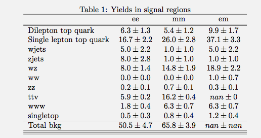
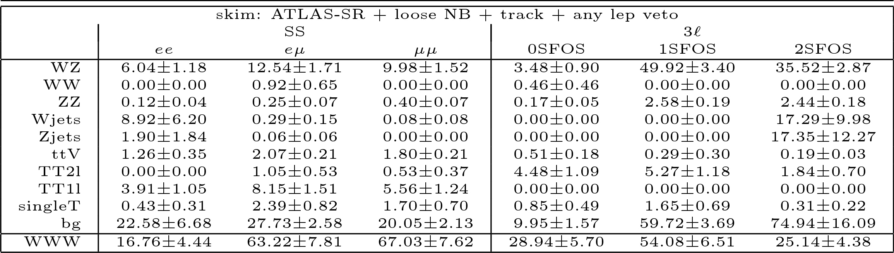
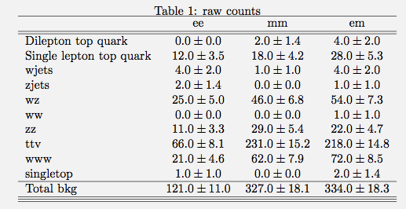
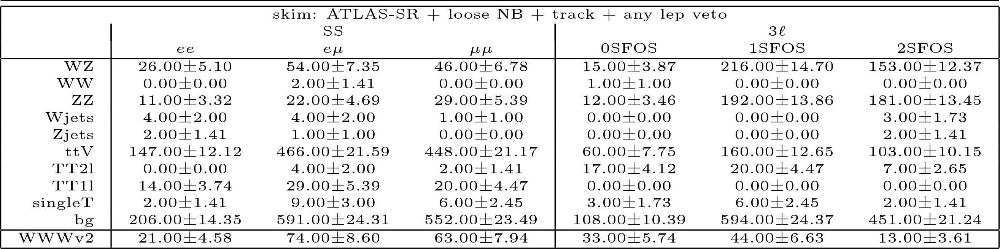

You can use MarkDown Viewer-like programs to see this in pretty format:
https://chrome.google.com/webstore/detail/markdown-viewer/ckkdlimhmcjmikdlpkmbgfkaikojcb

## Syncing up on May 25th

Synced up running few samples separately.
Now trying to sync up en masse.

### Mia's weighted yields

### HJ's weighted yields

### Philip's Weighted yields only SSmm
Total background column means nothing

|W|ZZ|tt1l|wwwincl|WW|ttX|WZ|tX|tt2l|Z|
|---------|---------|---------|---------|---------|---------|---------|---------|---------|---------|
|0.08+- 0.08| 0.40+- 0.07| 5.85+- 1.28| 3.75+- 0.55| 0.00+- 0.00| 1.81+- 0.21| 10.91+- 1.59| 1.82+- 0.70| 0.53+- 0.37| 0.00+- 0.00| 

### Mia's raw yields

### HJ's raw yields

### Philip's Raw yields only SSmm

|W|ZZ|tt1l|wwwincl|WW|WZ|Z|tt2l|ttX|tX|
|---------|---------|---------|---------|---------|---------|---------|---------|---------|---------|
|1.00+- 1.00| 29.00+- 5.39| 21.00+- 4.58| 64.00+- 8.00| 0.00+- 0.00| 47.00+- 6.86| 0.00+- 0.00| 2.00+- 1.41| 299.00+- 17.29| 179.00+- 13.38| 

### Philip's weighted yields SSmm

| W                   | ZZ                 | tt1l               | wwwincl         | WW              | ttX                | WZ                 | tX                 | tt2l               | Z                    | 
| ---------                      | ---------                     | ---------                     | ---------                  | ---------                  | ---------                     | ---------                     | ---------                     | ---------                     | ---------                       | 
| 245033.40+- 4841.88 | 8037.90+- 11.72    | 257393.14+- 268.52 | 290.74+- 4.80   | 2457.05+- 59.43 | 6281.67+- 35.85    | 25361.25+- 75.41   | 48678.52+- 103.00  | 124508.91+- 181.12 | 351168.42+- 2119.34  | 
| 245033.40+- 4841.88 | 8037.90+- 11.72    | 257393.14+- 268.52 | 290.74+- 4.80   | 2457.05+- 59.43 | 6281.67+- 35.85    | 25361.25+- 75.41   | 48678.52+- 103.00  | 124508.91+- 181.12 | 351168.42+- 2119.34  | 
| 1493.49+- 317.68    | 2143.92+- 6.04     | 1050.25+- 17.15    | 123.24+- 3.13   | 155.36+- 9.91   | 1385.04+- 11.82    | 8118.98+- 43.40    | 2113.34+- 22.97    | 25112.98+- 81.34   | 44997.14+- 577.48    | 
| 269.10+- 157.70     | 208.60+- 1.71      | 237.93+- 8.16      | 36.00+- 1.68    | 1.84+- 0.92     | 240.71+- 3.19      | 1414.02+- 18.11    | 79.30+- 3.22       | 94.85+- 5.00       | 186.17+- 35.57       | 
| 269.10+- 157.70     | 208.60+- 1.71      | 237.93+- 8.16      | 36.00+- 1.68    | 1.84+- 0.92     | 240.71+- 3.19      | 1414.02+- 18.11    | 79.30+- 3.22       | 94.85+- 5.00       | 186.17+- 35.57       | 
| 269.10+- 157.70     | 208.60+- 1.71      | 237.93+- 8.16      | 36.00+- 1.68    | 1.84+- 0.92     | 240.71+- 3.19      | 1414.02+- 18.11    | 79.30+- 3.22       | 94.85+- 5.00       | 186.17+- 35.57       | 
| 68.91+- 13.20       | 71.67+- 1.01       | 226.45+- 7.96      | 25.94+- 1.44    | 0.92+- 0.65     | 235.08+- 3.13      | 529.09+- 11.07     | 59.44+- 2.73       | 72.19+- 4.36       | 47.63+- 13.54        | 
| 32.20+- 8.02        | 26.70+- 0.61       | 204.70+- 7.57      | 24.97+- 1.41    | 0.46+- 0.46     | 173.73+- 2.29      | 310.01+- 8.47      | 41.31+- 2.52       | 51.90+- 3.70       | 16.59+- 9.00         | 
| 17.99+- 5.63        | 4.43+- 0.25        | 154.87+- 6.59      | 21.43+- 1.31    | 0.00+- 0.00     | 119.61+- 1.68      | 111.36+- 5.08      | 21.19+- 1.89       | 20.02+- 2.30       | 3.35+- 1.16          | 
| 7.90+- 3.37         | 3.93+- 0.24        | 144.46+- 6.36      | 20.88+- 1.30    | 0.00+- 0.00     | 113.05+- 1.64      | 101.03+- 4.84      | 19.53+- 1.81       | 19.23+- 2.25       | 2.83+- 1.07          | 
| 2.30+- 2.23         | 2.50+- 0.19        | 42.98+- 3.46       | 9.92+- 0.92     | 0.00+- 0.00     | 25.18+- 0.74       | 49.04+- 3.37       | 9.06+- 1.36        | 10.80+- 1.69       | 1.31+- 0.75          | 
| 0.08+- 0.08         | 1.14+- 0.13        | 29.02+- 2.85       | 7.07+- 0.76     | 0.00+- 0.00     | 20.03+- 0.67       | 22.92+- 2.30       | 5.34+- 1.04        | 6.85+- 1.34        | 1.31+- 0.75          | 
| 0.08+- 0.08         | 0.68+- 0.10        | 26.81+- 2.74       | 6.38+- 0.71     | 0.00+- 0.00     | 19.34+- 0.62       | 14.68+- 1.84       | 4.84+- 1.02        | 5.27+- 1.18        | 1.31+- 0.75          | 
| 0.08+- 0.08         | 0.68+- 0.10        | 26.81+- 2.74       | 6.38+- 0.71     | 0.00+- 0.00     | 19.34+- 0.62       | 14.68+- 1.84       | 4.84+- 1.02        | 5.27+- 1.18        | 1.31+- 0.75          | 
| 0.08+- 0.08         | 0.40+- 0.07        | 5.85+- 1.28        | 3.75+- 0.55     | 0.00+- 0.00     | 1.81+- 0.21        | 10.91+- 1.59       | 1.82+- 0.70        | 0.53+- 0.37        | 0.00+- 0.00          | 
| 0.00+- 0.00         | 0.00+- 0.00        | 0.00+- 0.00        | 0.00+- 0.00     | 0.00+- 0.00     | 0.00+- 0.00        | 0.00+- 0.00        | 0.00+- 0.00        | 0.00+- 0.00        | 0.00+- 0.00          | 
| 0.00+- 0.00         | 0.00+- 0.00        | 0.00+- 0.00        | 0.00+- 0.00     | 0.00+- 0.00     | 0.00+- 0.00        | 0.00+- 0.00        | 0.00+- 0.00        | 0.00+- 0.00        | 0.00+- 0.00          | 
| 0.00+- 0.00         | 0.00+- 0.00        | 0.00+- 0.00        | 0.00+- 0.00     | 0.00+- 0.00     | 0.00+- 0.00        | 0.00+- 0.00        | 0.00+- 0.00        | 0.00+- 0.00        | 0.00+- 0.00          | 
| 0.00+- 0.00         | 0.00+- 0.00        | 0.00+- 0.00        | 0.00+- 0.00     | 0.00+- 0.00     | 0.00+- 0.00        | 0.00+- 0.00        | 0.00+- 0.00        | 0.00+- 0.00        | 0.00+- 0.00          | 
| 0.00+- 0.00         | 0.00+- 0.00        | 0.00+- 0.00        | 0.00+- 0.00     | 0.00+- 0.00     | 0.00+- 0.00        | 0.00+- 0.00        | 0.00+- 0.00        | 0.00+- 0.00        | 0.00+- 0.00          | 

### Philip's raw yields SSmm

 | W                   | ZZ                 | tt1l               | wwwincl         | WW              | WZ                 | Z                  | tt2l               | ttX                | tX                   | 
 | ---------                      | ---------                     | ---------                     | ---------                  | ---------                  | ---------                     | ---------                     | ---------                     | ---------                     | ---------                       | 
 | 115372.00+- 339.66  | 583330.00+- 763.76 | 919331.00+- 958.82 | 4798.00+- 69.27 | 2814.00+- 53.05 | 155465.00+- 394.29 | 216670.00+- 465.48 | 472577.00+- 687.44 | 712694.00+- 844.21 | 1350936.00+- 1162.30 | 
 | 115372.00+- 339.66  | 583330.00+- 763.76 | 919331.00+- 958.82 | 4798.00+- 69.27 | 2814.00+- 53.05 | 155465.00+- 394.29 | 216670.00+- 465.48 | 472577.00+- 687.44 | 712694.00+- 844.21 | 1350936.00+- 1162.30 | 
 | 802.00+- 28.32      | 155294.00+- 394.07 | 3753.00+- 61.26    | 2041.00+- 45.18 | 309.00+- 17.58  | 35254.00+- 187.76  | 56884.00+- 238.50  | 95317.00+- 308.73  | 196556.00+- 443.35 | 471499.00+- 686.66   | 
 | 123.00+- 11.09      | 15105.00+- 122.90  | 850.00+- 29.15     | 587.00+- 24.23  | 4.00+- 2.00     | 6136.00+- 78.33    | 157.00+- 12.53     | 360.00+- 18.97     | 36993.00+- 192.34  | 60849.00+- 246.68    | 
 | 123.00+- 11.09      | 15105.00+- 122.90  | 850.00+- 29.15     | 587.00+- 24.23  | 4.00+- 2.00     | 6136.00+- 78.33    | 157.00+- 12.53     | 360.00+- 18.97     | 36993.00+- 192.34  | 60849.00+- 246.68    | 
 | 123.00+- 11.09      | 15105.00+- 122.90  | 850.00+- 29.15     | 587.00+- 24.23  | 4.00+- 2.00     | 6136.00+- 78.33    | 157.00+- 12.53     | 360.00+- 18.97     | 36993.00+- 192.34  | 60849.00+- 246.68    | 
 | 105.00+- 10.25      | 5197.00+- 72.09    | 809.00+- 28.44     | 430.00+- 20.74  | 2.00+- 1.41     | 2313.00+- 48.09    | 127.00+- 11.27     | 274.00+- 16.55     | 36086.00+- 189.96  | 50925.00+- 225.67    | 
 | 62.00+- 7.87        | 1936.00+- 44.00    | 731.00+- 27.04     | 414.00+- 20.35  | 1.00+- 1.00     | 1364.00+- 36.93    | 42.00+- 6.48       | 197.00+- 14.04     | 26764.00+- 163.60  | 26652.00+- 163.25    | 
 | 40.00+- 6.32        | 318.00+- 17.83     | 553.00+- 23.52     | 357.00+- 18.89  | 0.00+- 0.00     | 494.00+- 22.23     | 16.00+- 4.00       | 76.00+- 8.72       | 18126.00+- 134.63  | 10985.00+- 104.81    | 
 | 28.00+- 5.29        | 282.00+- 16.79     | 516.00+- 22.72     | 349.00+- 18.68  | 0.00+- 0.00     | 448.00+- 21.17     | 13.00+- 3.61       | 73.00+- 8.54       | 17099.00+- 130.76  | 10473.00+- 102.34    | 
 | 2.00+- 1.41         | 178.00+- 13.34     | 154.00+- 12.41     | 175.00+- 13.23  | 0.00+- 0.00     | 215.00+- 14.66     | 3.00+- 1.73        | 41.00+- 6.40       | 3655.00+- 60.46    | 3011.00+- 54.87      | 
 | 1.00+- 1.00         | 81.00+- 9.00       | 104.00+- 10.20     | 120.00+- 10.95  | 0.00+- 0.00     | 101.00+- 10.05     | 3.00+- 1.73        | 26.00+- 5.10       | 2922.00+- 54.06    | 1717.00+- 41.44      | 
 | 1.00+- 1.00         | 48.00+- 6.93       | 96.00+- 9.80       | 106.00+- 10.30  | 0.00+- 0.00     | 64.00+- 8.00       | 3.00+- 1.73        | 20.00+- 4.47       | 2817.00+- 53.08    | 1368.00+- 36.99      | 
 | 1.00+- 1.00         | 48.00+- 6.93       | 96.00+- 9.80       | 106.00+- 10.30  | 0.00+- 0.00     | 64.00+- 8.00       | 3.00+- 1.73        | 20.00+- 4.47       | 2816.00+- 53.07    | 1367.00+- 36.97      | 
 | 1.00+- 1.00         | 29.00+- 5.39       | 21.00+- 4.58       | 64.00+- 8.00    | 0.00+- 0.00     | 47.00+- 6.86       | 0.00+- 0.00        | 2.00+- 1.41        | 299.00+- 17.29     | 179.00+- 13.38       | 
 | 0.00+- 0.00         | 0.00+- 0.00        | 0.00+- 0.00        | 0.00+- 0.00     | 0.00+- 0.00     | 0.00+- 0.00        | 0.00+- 0.00        | 0.00+- 0.00        | 0.00+- 0.00        | 0.00+- 0.00          | 
 | 0.00+- 0.00         | 0.00+- 0.00        | 0.00+- 0.00        | 0.00+- 0.00     | 0.00+- 0.00     | 0.00+- 0.00        | 0.00+- 0.00        | 0.00+- 0.00        | 0.00+- 0.00        | 0.00+- 0.00          | 
 | 0.00+- 0.00         | 0.00+- 0.00        | 0.00+- 0.00        | 0.00+- 0.00     | 0.00+- 0.00     | 0.00+- 0.00        | 0.00+- 0.00        | 0.00+- 0.00        | 0.00+- 0.00        | 0.00+- 0.00          | 
 | 0.00+- 0.00         | 0.00+- 0.00        | 0.00+- 0.00        | 0.00+- 0.00     | 0.00+- 0.00     | 0.00+- 0.00        | 0.00+- 0.00        | 0.00+- 0.00        | 0.00+- 0.00        | 0.00+- 0.00          | 
 | 0.00+- 0.00         | 0.00+- 0.00        | 0.00+- 0.00        | 0.00+- 0.00     | 0.00+- 0.00     | 0.00+- 0.00        | 0.00+- 0.00        | 0.00+- 0.00        | 0.00+- 0.00        | 0.00+- 0.00          | 

### Philip's weighte yields SSem
| W                   | ZZ                 | tt1l               | wwwincl         | WW              | ttX                | WZ                 | tX                 | tt2l               | Z                    | 
| ---------                      | ---------                     | ---------                     | ---------                  | ---------                  | ---------                     | ---------                     | ---------                     | ---------                     | ---------                       | 
| 245033.40+- 4841.88 | 8037.90+- 11.72    | 257393.14+- 268.52 | 290.74+- 4.80   | 2457.05+- 59.43 | 6281.67+- 35.85    | 25361.25+- 75.41   | 48678.52+- 103.00  | 124508.91+- 181.12 | 351168.42+- 2119.34  | 
| 245033.40+- 4841.88 | 8037.90+- 11.72    | 257393.14+- 268.52 | 290.74+- 4.80   | 2457.05+- 59.43 | 6281.67+- 35.85    | 25361.25+- 75.41   | 48678.52+- 103.00  | 124508.91+- 181.12 | 351168.42+- 2119.34  | 
| 1493.49+- 317.68    | 2143.92+- 6.04     | 1050.25+- 17.15    | 123.24+- 3.13   | 155.36+- 9.91   | 1385.04+- 11.82    | 8118.98+- 43.40    | 2113.34+- 22.97    | 25112.98+- 81.34   | 44997.14+- 577.48    | 
| 779.06+- 224.98     | 364.57+- 2.26      | 500.68+- 11.84     | 53.89+- 2.07    | 25.80+- 5.02    | 397.97+- 5.14      | 2266.42+- 22.93    | 166.99+- 5.13      | 313.53+- 9.09      | 1030.18+- 97.81      | 
| 779.06+- 224.98     | 364.57+- 2.26      | 500.68+- 11.84     | 53.89+- 2.07    | 25.80+- 5.02    | 397.97+- 5.14      | 2266.42+- 22.93    | 166.99+- 5.13      | 313.53+- 9.09      | 1030.18+- 97.81      | 
| 779.06+- 224.98     | 364.57+- 2.26      | 500.68+- 11.84     | 53.89+- 2.07    | 25.80+- 5.02    | 397.97+- 5.14      | 2266.42+- 22.93    | 166.99+- 5.13      | 313.53+- 9.09      | 1030.18+- 97.81      | 
| 295.88+- 29.68      | 152.00+- 1.46      | 478.57+- 11.57     | 41.89+- 1.82    | 10.36+- 3.84    | 388.85+- 5.11      | 973.36+- 15.02     | 124.83+- 4.33      | 249.24+- 8.10      | 314.19+- 60.31       | 
| 281.03+- 29.23      | 73.47+- 1.02       | 454.23+- 11.27     | 40.16+- 1.78    | 8.29+- 3.24     | 308.81+- 4.50      | 690.78+- 12.65     | 98.56+- 4.09       | 204.71+- 7.34      | 216.09+- 56.50       | 
| 231.73+- 26.28      | 10.10+- 0.39       | 359.57+- 10.03     | 34.33+- 1.65    | 4.84+- 2.36     | 208.89+- 3.74      | 231.49+- 7.30      | 62.64+- 3.63       | 133.31+- 5.93      | 66.05+- 18.35        | 
| 112.28+- 17.91      | 9.16+- 0.37        | 322.95+- 9.51      | 33.01+- 1.62    | 2.77+- 1.13     | 197.80+- 3.63      | 214.13+- 7.03      | 55.62+- 3.38       | 122.78+- 5.69      | 55.31+- 18.02        | 
| 21.63+- 8.59        | 5.15+- 0.28        | 109.78+- 5.55      | 14.56+- 1.08    | 2.31+- 1.03     | 44.16+- 1.64       | 101.27+- 4.84      | 22.33+- 2.29       | 34.25+- 3.00       | 26.78+- 12.84        | 
| 16.49+- 7.34        | 2.27+- 0.18        | 79.84+- 4.73       | 10.13+- 0.90    | 1.38+- 0.80     | 34.87+- 1.42       | 48.75+- 3.36       | 14.00+- 1.83       | 20.29+- 2.31       | 13.49+- 9.08         | 
| 12.11+- 5.89        | 1.51+- 0.15        | 71.48+- 4.48       | 9.02+- 0.86     | 0.92+- 0.65     | 33.41+- 1.39       | 35.51+- 2.87       | 12.07+- 1.73       | 16.07+- 2.06       | 11.65+- 8.89         | 
| 12.11+- 5.89        | 1.51+- 0.15        | 71.48+- 4.48       | 9.02+- 0.86     | 0.92+- 0.65     | 33.40+- 1.39       | 35.51+- 2.87       | 12.07+- 1.73       | 16.07+- 2.06       | 11.65+- 8.89         | 
| 0.29+- 0.15         | 0.97+- 0.12        | 17.09+- 2.19       | 6.03+- 0.72     | 0.92+- 0.65     | 3.59+- 0.41        | 25.01+- 2.40       | 4.82+- 1.14        | 2.11+- 0.75        | 9.23+- 8.69          | 
| 0.29+- 0.15         | 0.28+- 0.07        | 8.71+- 1.56        | 4.16+- 0.60     | 0.92+- 0.65     | 2.26+- 0.27        | 13.00+- 1.74       | 2.54+- 0.82        | 1.32+- 0.59        | 0.06+- 0.06          | 
| 0.00+- 0.00         | 0.00+- 0.00        | 0.00+- 0.00        | 0.00+- 0.00     | 0.00+- 0.00     | 0.00+- 0.00        | 0.00+- 0.00        | 0.00+- 0.00        | 0.00+- 0.00        | 0.00+- 0.00          | 
| 0.00+- 0.00         | 0.00+- 0.00        | 0.00+- 0.00        | 0.00+- 0.00     | 0.00+- 0.00     | 0.00+- 0.00        | 0.00+- 0.00        | 0.00+- 0.00        | 0.00+- 0.00        | 0.00+- 0.00          | 
| 0.00+- 0.00         | 0.00+- 0.00        | 0.00+- 0.00        | 0.00+- 0.00     | 0.00+- 0.00     | 0.00+- 0.00        | 0.00+- 0.00        | 0.00+- 0.00        | 0.00+- 0.00        | 0.00+- 0.00          | 
| 0.00+- 0.00         | 0.00+- 0.00        | 0.00+- 0.00        | 0.00+- 0.00     | 0.00+- 0.00     | 0.00+- 0.00        | 0.00+- 0.00        | 0.00+- 0.00        | 0.00+- 0.00        | 0.00+- 0.00          | 

### Philips raw yields SSem
| W                   | ZZ                 | tt1l               | wwwincl         | WW              | WZ                 | Z                  | tt2l               | ttX                | tX                   | 
| ---------                      | ---------                     | ---------                     | ---------                  | ---------                  | ---------                     | ---------                     | ---------                     | ---------                     | ---------                       | 
| 115372.00+- 339.66  | 583330.00+- 763.76 | 919331.00+- 958.82 | 4798.00+- 69.27 | 2814.00+- 53.05 | 155465.00+- 394.29 | 216670.00+- 465.48 | 472577.00+- 687.44 | 712694.00+- 844.21 | 1350936.00+- 1162.30 | 
| 115372.00+- 339.66  | 583330.00+- 763.76 | 919331.00+- 958.82 | 4798.00+- 69.27 | 2814.00+- 53.05 | 155465.00+- 394.29 | 216670.00+- 465.48 | 472577.00+- 687.44 | 712694.00+- 844.21 | 1350936.00+- 1162.30 | 
| 802.00+- 28.32      | 155294.00+- 394.07 | 3753.00+- 61.26    | 2041.00+- 45.18 | 309.00+- 17.58  | 35254.00+- 187.76  | 56884.00+- 238.50  | 95317.00+- 308.73  | 196556.00+- 443.35 | 471499.00+- 686.66   | 
| 405.00+- 20.12      | 26394.00+- 162.46  | 1790.00+- 42.31    | 895.00+- 29.92  | 42.00+- 6.48    | 9911.00+- 99.55    | 609.00+- 24.68     | 1190.00+- 34.50    | 58350.00+- 241.56  | 103089.00+- 321.07   | 
| 405.00+- 20.12      | 26394.00+- 162.46  | 1790.00+- 42.31    | 895.00+- 29.92  | 42.00+- 6.48    | 9911.00+- 99.55    | 609.00+- 24.68     | 1190.00+- 34.50    | 58350.00+- 241.56  | 103089.00+- 321.07   | 
| 405.00+- 20.12      | 26394.00+- 162.46  | 1790.00+- 42.31    | 895.00+- 29.92  | 42.00+- 6.48    | 9911.00+- 99.55    | 609.00+- 24.68     | 1190.00+- 34.50    | 58350.00+- 241.56  | 103089.00+- 321.07   | 
| 348.00+- 18.65      | 11002.00+- 104.89  | 1711.00+- 41.36    | 688.00+- 26.23  | 12.00+- 3.46    | 4300.00+- 65.57    | 482.00+- 21.95     | 946.00+- 30.76     | 57140.00+- 239.04  | 88694.00+- 297.82    | 
| 315.00+- 17.75      | 5323.00+- 72.96    | 1624.00+- 40.30    | 661.00+- 25.71  | 11.00+- 3.32    | 3076.00+- 55.46    | 283.00+- 16.82     | 777.00+- 27.87     | 44280.00+- 210.43  | 57249.00+- 239.27    | 
| 271.00+- 16.46      | 741.00+- 27.22     | 1285.00+- 35.85    | 567.00+- 23.81  | 7.00+- 2.65     | 1073.00+- 32.76    | 129.00+- 11.36     | 506.00+- 22.49     | 28456.00+- 168.69  | 20002.00+- 141.43    | 
| 160.00+- 12.65      | 671.00+- 25.90     | 1154.00+- 33.97    | 546.00+- 23.37  | 6.00+- 2.45     | 977.00+- 31.26     | 90.00+- 9.49       | 466.00+- 21.59     | 26830.00+- 163.80  | 18975.00+- 137.75    | 
| 12.00+- 3.46        | 375.00+- 19.36     | 392.00+- 19.80     | 244.00+- 15.62  | 5.00+- 2.24     | 458.00+- 21.40     | 16.00+- 4.00       | 130.00+- 11.40     | 5626.00+- 75.01    | 4937.00+- 70.26      | 
| 10.00+- 3.16        | 169.00+- 13.00     | 285.00+- 16.88     | 170.00+- 13.04  | 3.00+- 1.73     | 223.00+- 14.93     | 10.00+- 3.16       | 77.00+- 8.77       | 4485.00+- 66.97    | 2880.00+- 53.67      | 
| 9.00+- 3.00         | 114.00+- 10.68     | 255.00+- 15.97     | 154.00+- 12.41  | 2.00+- 1.41     | 164.00+- 12.81     | 9.00+- 3.00        | 61.00+- 7.81       | 4340.00+- 65.88    | 2320.00+- 48.17      | 
| 9.00+- 3.00         | 114.00+- 10.68     | 255.00+- 15.97     | 154.00+- 12.41  | 2.00+- 1.41     | 164.00+- 12.81     | 9.00+- 3.00        | 61.00+- 7.81       | 4339.00+- 65.87    | 2319.00+- 48.16      | 
| 4.00+- 2.00         | 72.00+- 8.49       | 61.00+- 7.81       | 107.00+- 10.34  | 2.00+- 1.41     | 110.00+- 10.49     | 4.00+- 2.00        | 8.00+- 2.83        | 416.00+- 20.40     | 367.00+- 19.16       | 
| 4.00+- 2.00         | 23.00+- 4.80       | 31.00+- 5.57       | 74.00+- 8.60    | 2.00+- 1.41     | 56.00+- 7.48       | 1.00+- 1.00        | 5.00+- 2.24        | 288.00+- 16.97     | 210.00+- 14.49       | 
| 0.00+- 0.00         | 0.00+- 0.00        | 0.00+- 0.00        | 0.00+- 0.00     | 0.00+- 0.00     | 0.00+- 0.00        | 0.00+- 0.00        | 0.00+- 0.00        | 0.00+- 0.00        | 0.00+- 0.00          | 
| 0.00+- 0.00         | 0.00+- 0.00        | 0.00+- 0.00        | 0.00+- 0.00     | 0.00+- 0.00     | 0.00+- 0.00        | 0.00+- 0.00        | 0.00+- 0.00        | 0.00+- 0.00        | 0.00+- 0.00          | 
| 0.00+- 0.00         | 0.00+- 0.00        | 0.00+- 0.00        | 0.00+- 0.00     | 0.00+- 0.00     | 0.00+- 0.00        | 0.00+- 0.00        | 0.00+- 0.00        | 0.00+- 0.00        | 0.00+- 0.00          | 
| 0.00+- 0.00         | 0.00+- 0.00        | 0.00+- 0.00        | 0.00+- 0.00     | 0.00+- 0.00     | 0.00+- 0.00        | 0.00+- 0.00        | 0.00+- 0.00        | 0.00+- 0.00        | 0.00+- 0.00          | 

### Philip's weighted yields SSee
| W                   | ZZ                 | tt1l               | wwwincl         | WW              | ttX                | WZ                 | tX                 | tt2l               | Z                    | 
| ---------                      | ---------                     | ---------                     | ---------                  | ---------                  | ---------                     | ---------                     | ---------                     | ---------                     | ---------                       | 
| 245033.40+- 4841.88 | 8037.90+- 11.72    | 257393.14+- 268.52 | 290.74+- 4.80   | 2457.05+- 59.43 | 6281.67+- 35.85    | 25361.25+- 75.41   | 48678.52+- 103.00  | 124508.91+- 181.12 | 351168.42+- 2119.34  | 
| 245033.40+- 4841.88 | 8037.90+- 11.72    | 257393.14+- 268.52 | 290.74+- 4.80   | 2457.05+- 59.43 | 6281.67+- 35.85    | 25361.25+- 75.41   | 48678.52+- 103.00  | 124508.91+- 181.12 | 351168.42+- 2119.34  | 
| 1493.49+- 317.68    | 2143.92+- 6.04     | 1050.25+- 17.15    | 123.24+- 3.13   | 155.36+- 9.91   | 1385.04+- 11.82    | 8118.98+- 43.40    | 2113.34+- 22.97    | 25112.98+- 81.34   | 44997.14+- 577.48    | 
| 358.36+- 158.87     | 163.76+- 1.55      | 240.38+- 8.20      | 17.62+- 1.21    | 16.36+- 3.30    | 160.50+- 3.72      | 900.64+- 14.45     | 74.85+- 3.53       | 159.40+- 6.48      | 8220.50+- 261.53     | 
| 358.36+- 158.87     | 163.76+- 1.55      | 240.38+- 8.20      | 17.62+- 1.21    | 16.36+- 3.30    | 160.50+- 3.72      | 900.64+- 14.45     | 74.85+- 3.53       | 159.40+- 6.48      | 8220.50+- 261.53     | 
| 358.36+- 158.87     | 163.76+- 1.55      | 240.38+- 8.20      | 17.62+- 1.21    | 16.36+- 3.30    | 160.50+- 3.72      | 900.64+- 14.45     | 74.85+- 3.53       | 159.40+- 6.48      | 8220.50+- 261.53     | 
| 132.51+- 20.79      | 82.61+- 1.13       | 231.14+- 8.04      | 14.01+- 1.07    | 3.23+- 1.22     | 157.35+- 3.70      | 397.19+- 9.59      | 53.69+- 2.86       | 132.52+- 5.91      | 1187.31+- 93.29      | 
| 127.15+- 20.31      | 55.44+- 0.94       | 219.72+- 7.84      | 13.18+- 1.04    | 3.23+- 1.22     | 128.98+- 3.45      | 322.85+- 8.65      | 46.11+- 2.74       | 114.61+- 5.50      | 1146.04+- 91.98      | 
| 118.02+- 19.58      | 8.86+- 0.46        | 175.10+- 7.00      | 11.51+- 0.97    | 2.77+- 1.13     | 85.67+- 2.91       | 100.98+- 4.82      | 28.18+- 2.38       | 84.31+- 4.71       | 1039.40+- 89.44      | 
| 74.03+- 15.56       | 8.37+- 0.45        | 159.91+- 6.69      | 11.37+- 0.96    | 2.31+- 1.03     | 81.15+- 2.82       | 94.52+- 4.67       | 25.45+- 2.25       | 80.36+- 4.60       | 985.54+- 75.59       | 
| 31.97+- 11.22       | 4.81+- 0.34        | 51.67+- 3.80       | 4.85+- 0.66     | 1.84+- 0.92     | 17.48+- 1.27       | 42.82+- 3.15       | 9.46+- 1.46        | 25.03+- 2.57       | 602.40+- 65.87       | 
| 25.28+- 10.09       | 2.92+- 0.27        | 39.93+- 3.34       | 4.30+- 0.60     | 0.46+- 0.46     | 14.38+- 1.21       | 21.24+- 2.22       | 5.84+- 1.17        | 14.49+- 1.95       | 288.42+- 43.98       | 
| 16.44+- 7.95        | 2.24+- 0.25        | 37.15+- 3.22       | 3.61+- 0.55     | 0.00+- 0.00     | 13.83+- 1.19       | 15.90+- 1.92       | 5.33+- 1.13        | 11.59+- 1.75       | 201.67+- 35.25       | 
| 16.44+- 7.95        | 2.24+- 0.25        | 37.15+- 3.22       | 3.61+- 0.55     | 0.00+- 0.00     | 13.83+- 1.19       | 15.90+- 1.92       | 5.33+- 1.13        | 11.59+- 1.75       | 201.67+- 35.25       | 
| 15.61+- 7.92        | 1.36+- 0.19        | 8.94+- 1.58        | 2.29+- 0.44     | 0.00+- 0.00     | 1.99+- 0.43        | 11.20+- 1.61       | 1.61+- 0.64        | 1.84+- 0.70        | 165.97+- 33.54       | 
| 11.22+- 6.59        | 0.51+- 0.10        | 7.82+- 1.48        | 1.80+- 0.40     | 0.00+- 0.00     | 1.88+- 0.43        | 9.29+- 1.47        | 1.60+- 0.64        | 1.05+- 0.53        | 24.87+- 12.71        | 
| 8.92+- 6.20         | 0.13+- 0.04        | 3.91+- 1.05        | 1.18+- 0.32     | 0.00+- 0.00     | 1.28+- 0.35        | 6.04+- 1.18        | 0.45+- 0.32        | 0.26+- 0.26        | 1.90+- 1.84          | 
| 0.00+- 0.00         | 0.00+- 0.00        | 0.00+- 0.00        | 0.00+- 0.00     | 0.00+- 0.00     | 0.00+- 0.00        | 0.00+- 0.00        | 0.00+- 0.00        | 0.00+- 0.00        | 0.00+- 0.00          | 
| 0.00+- 0.00         | 0.00+- 0.00        | 0.00+- 0.00        | 0.00+- 0.00     | 0.00+- 0.00     | 0.00+- 0.00        | 0.00+- 0.00        | 0.00+- 0.00        | 0.00+- 0.00        | 0.00+- 0.00          | 
| 0.00+- 0.00         | 0.00+- 0.00        | 0.00+- 0.00        | 0.00+- 0.00     | 0.00+- 0.00     | 0.00+- 0.00        | 0.00+- 0.00        | 0.00+- 0.00        | 0.00+- 0.00        | 0.00+- 0.00          | 

### Philip's raw yields SSee
| W                   | ZZ                 | tt1l               | wwwincl         | WW              | WZ                 | Z                  | tt2l               | ttX                | tX                   | 
| ---------                      | ---------                     | ---------                     | ---------                  | ---------                  | ---------                     | ---------                     | ---------                     | ---------                     | ---------                       | 
| 115372.00+- 339.66  | 583330.00+- 763.76 | 919331.00+- 958.82 | 4798.00+- 69.27 | 2814.00+- 53.05 | 155465.00+- 394.29 | 216670.00+- 465.48 | 472577.00+- 687.44 | 712694.00+- 844.21 | 1350936.00+- 1162.30 | 
| 115372.00+- 339.66  | 583330.00+- 763.76 | 919331.00+- 958.82 | 4798.00+- 69.27 | 2814.00+- 53.05 | 155465.00+- 394.29 | 216670.00+- 465.48 | 472577.00+- 687.44 | 712694.00+- 844.21 | 1350936.00+- 1162.30 | 
| 802.00+- 28.32      | 155294.00+- 394.07 | 3753.00+- 61.26    | 2041.00+- 45.18 | 309.00+- 17.58  | 35254.00+- 187.76  | 56884.00+- 238.50  | 95317.00+- 308.73  | 196556.00+- 443.35 | 471499.00+- 686.66   | 
| 167.00+- 12.92      | 11995.00+- 109.52  | 859.00+- 29.31     | 304.00+- 17.44  | 32.00+- 5.66    | 3945.00+- 62.81    | 2885.00+- 53.71    | 605.00+- 24.60     | 23043.00+- 151.80  | 42847.00+- 207.00    | 
| 167.00+- 12.92      | 11995.00+- 109.52  | 859.00+- 29.31     | 304.00+- 17.44  | 32.00+- 5.66    | 3945.00+- 62.81    | 2885.00+- 53.71    | 605.00+- 24.60     | 23043.00+- 151.80  | 42847.00+- 207.00    | 
| 167.00+- 12.92      | 11995.00+- 109.52  | 859.00+- 29.31     | 304.00+- 17.44  | 32.00+- 5.66    | 3945.00+- 62.81    | 2885.00+- 53.71    | 605.00+- 24.60     | 23043.00+- 151.80  | 42847.00+- 207.00    | 
| 141.00+- 11.87      | 6018.00+- 77.58    | 826.00+- 28.74     | 240.00+- 15.49  | 7.00+- 2.65     | 1756.00+- 41.90    | 1893.00+- 43.51    | 503.00+- 22.43     | 22609.00+- 150.36  | 37777.00+- 194.36    | 
| 133.00+- 11.53      | 4048.00+- 63.62    | 785.00+- 28.02     | 226.00+- 15.03  | 7.00+- 2.65     | 1435.00+- 37.88    | 1819.00+- 42.65    | 435.00+- 20.86     | 18059.00+- 134.38  | 28144.00+- 167.76    | 
| 125.00+- 11.18      | 673.00+- 25.94     | 626.00+- 25.02     | 196.00+- 14.00  | 6.00+- 2.45     | 471.00+- 21.70     | 1613.00+- 40.16    | 320.00+- 17.89     | 11034.00+- 105.04  | 9225.00+- 96.05      | 
| 91.00+- 9.54        | 631.00+- 25.12     | 572.00+- 23.92     | 190.00+- 13.78  | 5.00+- 2.24     | 436.00+- 20.88     | 1598.00+- 39.97    | 305.00+- 17.46     | 10398.00+- 101.97  | 8749.00+- 93.54      | 
| 15.00+- 3.87        | 353.00+- 18.79     | 185.00+- 13.60     | 90.00+- 9.49    | 4.00+- 2.00     | 199.00+- 14.11     | 189.00+- 13.75     | 95.00+- 9.75       | 2102.00+- 45.85    | 2106.00+- 45.89      | 
| 12.00+- 3.46        | 203.00+- 14.25     | 143.00+- 11.96     | 74.00+- 8.60    | 1.00+- 1.00     | 99.00+- 9.95       | 113.00+- 10.63     | 55.00+- 7.42       | 1704.00+- 41.28    | 1257.00+- 35.45      | 
| 9.00+- 3.00         | 149.00+- 12.21     | 133.00+- 11.53     | 64.00+- 8.00    | 0.00+- 0.00     | 74.00+- 8.60       | 97.00+- 9.85       | 44.00+- 6.63       | 1648.00+- 40.60    | 1031.00+- 32.11      | 
| 9.00+- 3.00         | 149.00+- 12.21     | 133.00+- 11.53     | 64.00+- 8.00    | 0.00+- 0.00     | 74.00+- 8.60       | 97.00+- 9.85       | 44.00+- 6.63       | 1648.00+- 40.60    | 1031.00+- 32.11      | 
| 7.00+- 2.65         | 90.00+- 9.49       | 32.00+- 5.66       | 41.00+- 6.40    | 0.00+- 0.00     | 53.00+- 7.28       | 64.00+- 8.00       | 7.00+- 2.65        | 156.00+- 12.49     | 163.00+- 12.77       | 
| 6.00+- 2.45         | 37.00+- 6.08       | 28.00+- 5.29       | 34.00+- 5.83    | 0.00+- 0.00     | 42.00+- 6.48       | 14.00+- 3.74       | 4.00+- 2.00        | 137.00+- 11.70     | 136.00+- 11.66       | 
| 4.00+- 2.00         | 11.00+- 3.32       | 14.00+- 3.74       | 21.00+- 4.58    | 0.00+- 0.00     | 26.00+- 5.10       | 2.00+- 1.41        | 1.00+- 1.00        | 96.00+- 9.80       | 65.00+- 8.06         | 
| 0.00+- 0.00         | 0.00+- 0.00        | 0.00+- 0.00        | 0.00+- 0.00     | 0.00+- 0.00     | 0.00+- 0.00        | 0.00+- 0.00        | 0.00+- 0.00        | 0.00+- 0.00        | 0.00+- 0.00          | 
| 0.00+- 0.00         | 0.00+- 0.00        | 0.00+- 0.00        | 0.00+- 0.00     | 0.00+- 0.00     | 0.00+- 0.00        | 0.00+- 0.00        | 0.00+- 0.00        | 0.00+- 0.00        | 0.00+- 0.00          | 
| 0.00+- 0.00         | 0.00+- 0.00        | 0.00+- 0.00        | 0.00+- 0.00     | 0.00+- 0.00     | 0.00+- 0.00        | 0.00+- 0.00        | 0.00+- 0.00        | 0.00+- 0.00        | 0.00+- 0.00          | 

### Philip's weighted yields 3L0SFOS
|W|ZZ|tt1l|wwwincl|WW|ttX|WZ|tX|tt2l|Z|
|---------|---------|---------|---------|---------|---------|---------|---------|---------|---------|
|245033.40+- 4841.88| 8037.90+- 11.72| 257393.14+- 268.52| 290.74+- 4.80| 2457.05+- 59.43| 6281.67+- 35.85| 25361.25+- 75.41| 48678.52+- 103.00| 124508.91+- 181.12| 351168.42+- 2119.34| 
|245033.40+- 4841.88| 8037.90+- 11.72| 257393.14+- 268.52| 290.74+- 4.80| 2457.05+- 59.43| 6281.67+- 35.85| 25361.25+- 75.41| 48678.52+- 103.00| 124508.91+- 181.12| 351168.42+- 2119.34| 
|283.53+- 157.84| 1684.37+- 4.85| 36.90+- 3.22| 28.09+- 1.51| 14.73+- 4.48| 524.30+- 5.75| 6590.96+- 39.11| 234.49+- 3.82| 473.45+- 11.17| 2425.16+- 129.87| 
|0.08+- 0.08| 4.54+- 0.25| 1.13+- 0.57| 6.80+- 0.75| 2.31+- 1.03| 47.41+- 1.95| 21.30+- 2.23| 10.99+- 1.61| 112.50+- 5.44| 10.71+- 8.87| 
|0.00+- 0.00| 1.24+- 0.13| 0.29+- 0.29| 2.70+- 0.49| 0.46+- 0.46| 13.67+- 1.08| 9.52+- 1.49| 4.24+- 1.02| 36.10+- 3.08| 0.06+- 0.06| 
|0.00+- 0.00| 0.32+- 0.07| 0.00+- 0.00| 1.04+- 0.27| 0.00+- 0.00| 1.61+- 0.36| 3.48+- 0.90| 1.01+- 0.51| 11.33+- 1.73| 0.00+- 0.00| 
|0.00+- 0.00| 0.32+- 0.07| 0.00+- 0.00| 1.04+- 0.27| 0.00+- 0.00| 1.61+- 0.36| 3.48+- 0.90| 1.01+- 0.51| 11.33+- 1.73| 0.00+- 0.00| 
|0.00+- 0.00| 0.32+- 0.07| 0.00+- 0.00| 1.04+- 0.27| 0.00+- 0.00| 0.96+- 0.35| 3.02+- 0.84| 0.97+- 0.51| 6.85+- 1.34| 0.00+- 0.00| 
|0.00+- 0.00| 0.32+- 0.07| 0.00+- 0.00| 1.04+- 0.27| 0.00+- 0.00| 0.95+- 0.35| 3.02+- 0.84| 0.97+- 0.51| 6.32+- 1.29| 0.00+- 0.00| 
|0.00+- 0.00| 0.00+- 0.00| 0.00+- 0.00| 0.00+- 0.00| 0.00+- 0.00| 0.00+- 0.00| 0.00+- 0.00| 0.00+- 0.00| 0.00+- 0.00| 0.00+- 0.00| 
|0.00+- 0.00| 0.00+- 0.00| 0.00+- 0.00| 0.00+- 0.00| 0.00+- 0.00| 0.00+- 0.00| 0.00+- 0.00| 0.00+- 0.00| 0.00+- 0.00| 0.00+- 0.00| 
|0.00+- 0.00| 0.00+- 0.00| 0.00+- 0.00| 0.00+- 0.00| 0.00+- 0.00| 0.00+- 0.00| 0.00+- 0.00| 0.00+- 0.00| 0.00+- 0.00| 0.00+- 0.00| 
|0.00+- 0.00| 0.00+- 0.00| 0.00+- 0.00| 0.00+- 0.00| 0.00+- 0.00| 0.00+- 0.00| 0.00+- 0.00| 0.00+- 0.00| 0.00+- 0.00| 0.00+- 0.00| 
|0.00+- 0.00| 0.00+- 0.00| 0.00+- 0.00| 0.00+- 0.00| 0.00+- 0.00| 0.00+- 0.00| 0.00+- 0.00| 0.00+- 0.00| 0.00+- 0.00| 0.00+- 0.00| 
|0.00+- 0.00| 0.00+- 0.00| 0.00+- 0.00| 0.00+- 0.00| 0.00+- 0.00| 0.00+- 0.00| 0.00+- 0.00| 0.00+- 0.00| 0.00+- 0.00| 0.00+- 0.00| 
|0.00+- 0.00| 0.00+- 0.00| 0.00+- 0.00| 0.00+- 0.00| 0.00+- 0.00| 0.00+- 0.00| 0.00+- 0.00| 0.00+- 0.00| 0.00+- 0.00| 0.00+- 0.00| 
|0.00+- 0.00| 0.00+- 0.00| 0.00+- 0.00| 0.00+- 0.00| 0.00+- 0.00| 0.00+- 0.00| 0.00+- 0.00| 0.00+- 0.00| 0.00+- 0.00| 0.00+- 0.00| 
|0.00+- 0.00| 0.00+- 0.00| 0.00+- 0.00| 0.00+- 0.00| 0.00+- 0.00| 0.00+- 0.00| 0.00+- 0.00| 0.00+- 0.00| 0.00+- 0.00| 0.00+- 0.00| 
|0.00+- 0.00| 0.00+- 0.00| 0.00+- 0.00| 0.00+- 0.00| 0.00+- 0.00| 0.00+- 0.00| 0.00+- 0.00| 0.00+- 0.00| 0.00+- 0.00| 0.00+- 0.00| 
|0.00+- 0.00| 0.00+- 0.00| 0.00+- 0.00| 0.00+- 0.00| 0.00+- 0.00| 0.00+- 0.00| 0.00+- 0.00| 0.00+- 0.00| 0.00+- 0.00| 0.00+- 0.00| 

### Philip's weighted yields 3L2SFOS
|W|ZZ|tt1l|wwwincl|WW|ttX|WZ|tX|tt2l|Z|
|---------|---------|---------|---------|---------|---------|---------|---------|---------|---------|
|245033.40+- 4841.88| 8037.90+- 11.72| 257393.14+- 268.52| 290.74+- 4.80| 2457.05+- 59.43| 6281.67+- 35.85| 25361.25+- 75.41| 48678.52+- 103.00| 124508.91+- 181.12| 351168.42+- 2119.34| 
|245033.40+- 4841.88| 8037.90+- 11.72| 257393.14+- 268.52| 290.74+- 4.80| 2457.05+- 59.43| 6281.67+- 35.85| 25361.25+- 75.41| 48678.52+- 103.00| 124508.91+- 181.12| 351168.42+- 2119.34| 
|283.53+- 157.84| 1684.37+- 4.85| 36.90+- 3.22| 28.09+- 1.51| 14.73+- 4.48| 524.30+- 5.75| 6590.96+- 39.11| 234.49+- 3.82| 473.45+- 11.17| 2425.16+- 129.87| 
|94.03+- 17.30| 844.48+- 3.43| 17.12+- 2.19| 7.77+- 0.78| 7.37+- 3.17| 224.20+- 3.72| 3378.15+- 28.00| 108.75+- 2.13| 119.88+- 5.62| 826.97+- 73.37| 
|14.34+- 7.00| 229.93+- 1.79| 5.11+- 1.20| 4.09+- 0.55| 0.92+- 0.65| 66.01+- 2.01| 1521.53+- 18.79| 30.68+- 1.02| 36.62+- 3.11| 249.88+- 40.22| 
|0.00+- 0.00| 172.54+- 1.55| 0.00+- 0.00| 3.05+- 0.47| 0.46+- 0.46| 3.70+- 0.44| 1273.54+- 17.19| 5.48+- 0.65| 15.02+- 1.99| 187.81+- 37.52| 
|0.00+- 0.00| 158.92+- 1.48| 0.00+- 0.00| 2.98+- 0.47| 0.46+- 0.46| 1.08+- 0.31| 1204.59+- 16.72| 2.84+- 0.46| 6.06+- 1.26| 166.23+- 35.36| 
|0.00+- 0.00| 94.06+- 1.14| 0.00+- 0.00| 2.15+- 0.40| 0.46+- 0.46| 0.62+- 0.25| 661.38+- 12.39| 1.66+- 0.36| 4.74+- 1.12| 137.05+- 31.94| 
|0.00+- 0.00| 53.95+- 0.86| 0.00+- 0.00| 1.80+- 0.37| 0.00+- 0.00| 0.42+- 0.25| 353.55+- 9.06| 1.16+- 0.36| 2.90+- 0.87| 92.71+- 26.50| 

### Philip's raw yields 3L2SFOS
|W|ZZ|tt1l|wwwincl|WW|WZ|Z|tt2l|ttX|tX|
|---------|---------|---------|---------|---------|---------|---------|---------|---------|---------|
|115372.00+- 339.66| 583330.00+- 763.76| 919331.00+- 958.82| 4798.00+- 69.27| 2814.00+- 53.05| 155465.00+- 394.29| 216670.00+- 465.48| 472577.00+- 687.44| 712694.00+- 844.21| 1350936.00+- 1162.30| 
|115372.00+- 339.66| 583330.00+- 763.76| 919331.00+- 958.82| 4798.00+- 69.27| 2814.00+- 53.05| 155465.00+- 394.29| 216670.00+- 465.48| 472577.00+- 687.44| 712694.00+- 844.21| 1350936.00+- 1162.30| 
|138.00+- 11.75| 121845.00+- 349.06| 131.00+- 11.45| 475.00+- 21.79| 18.00+- 4.24| 28419.00+- 168.58| 1910.00+- 43.70| 1797.00+- 42.39| 85382.00+- 292.20| 332920.00+- 576.99| 
|90.00+- 9.49| 61094.00+- 247.17| 61.00+- 7.81| 126.00+- 11.22| 9.00+- 3.00| 14561.00+- 120.67| 756.00+- 27.50| 455.00+- 21.33| 36495.00+- 191.04| 172061.00+- 414.80| 
|11.00+- 3.32| 16646.00+- 129.02| 18.00+- 4.24| 63.00+- 7.94| 2.00+- 1.41| 6555.00+- 80.96| 206.00+- 14.35| 139.00+- 11.79| 10350.00+- 101.73| 47599.00+- 218.17| 
|0.00+- 0.00| 12498.00+- 111.79| 0.00+- 0.00| 46.00+- 6.78| 1.00+- 1.00| 5486.00+- 74.07| 44.00+- 6.63| 57.00+- 7.55| 500.00+- 22.36| 6963.00+- 83.44| 
|0.00+- 0.00| 11512.00+- 107.29| 0.00+- 0.00| 45.00+- 6.71| 1.00+- 1.00| 5189.00+- 72.03| 37.00+- 6.08| 23.00+- 4.80| 153.00+- 12.37| 3470.00+- 58.91| 
|0.00+- 0.00| 6816.00+- 82.56| 0.00+- 0.00| 33.00+- 5.74| 1.00+- 1.00| 2849.00+- 53.38| 30.00+- 5.48| 18.00+- 4.24| 104.00+- 10.20| 1906.00+- 43.66| 
|0.00+- 0.00| 3914.00+- 62.56| 0.00+- 0.00| 28.00+- 5.29| 0.00+- 0.00| 1523.00+- 39.03| 20.00+- 4.47| 11.00+- 3.32| 71.00+- 8.43| 984.00+- 31.37| 

### Philip's weighted yields 3L0SFOS
|W|ZZ|tt1l|wwwincl|WW|ttX|WZ|tX|tt2l|Z|
|---------|---------|---------|---------|---------|---------|---------|---------|---------|---------|
|245033.40+- 4841.88| 8037.90+- 11.72| 257393.14+- 268.52| 290.74+- 4.80| 2457.05+- 59.43| 6281.67+- 35.85| 25361.25+- 75.41| 48678.52+- 103.00| 124508.91+- 181.12| 351168.42+- 2119.34| 
|245033.40+- 4841.88| 8037.90+- 11.72| 257393.14+- 268.52| 290.74+- 4.80| 2457.05+- 59.43| 6281.67+- 35.85| 25361.25+- 75.41| 48678.52+- 103.00| 124508.91+- 181.12| 351168.42+- 2119.34| 
|283.53+- 157.84| 1684.37+- 4.85| 36.90+- 3.22| 28.09+- 1.51| 14.73+- 4.48| 524.30+- 5.75| 6590.96+- 39.11| 234.49+- 3.82| 473.45+- 11.17| 2425.16+- 129.87| 
|0.08+- 0.08| 4.54+- 0.25| 1.13+- 0.57| 6.80+- 0.75| 2.31+- 1.03| 47.41+- 1.95| 21.30+- 2.23| 10.99+- 1.61| 112.50+- 5.44| 10.71+- 8.87| 
|0.00+- 0.00| 1.24+- 0.13| 0.29+- 0.29| 2.70+- 0.49| 0.46+- 0.46| 13.67+- 1.08| 9.52+- 1.49| 4.24+- 1.02| 36.10+- 3.08| 0.06+- 0.06| 
|0.00+- 0.00| 0.94+- 0.11| 0.00+- 0.00| 2.08+- 0.44| 0.46+- 0.46| 1.95+- 0.26| 8.82+- 1.43| 3.35+- 0.97| 16.34+- 2.07| 0.00+- 0.00| 
|0.00+- 0.00| 0.91+- 0.11| 0.00+- 0.00| 1.87+- 0.42| 0.46+- 0.46| 0.71+- 0.18| 8.13+- 1.37| 2.99+- 0.93| 7.38+- 1.39| 0.00+- 0.00| 
|0.00+- 0.00| 0.90+- 0.11| 0.00+- 0.00| 1.87+- 0.42| 0.46+- 0.46| 0.69+- 0.18| 7.89+- 1.35| 2.99+- 0.93| 7.38+- 1.39| 0.00+- 0.00| 

### Philip's raw yields 3L0SFOS
|W|ZZ|tt1l|wwwincl|WW|WZ|Z|tt2l|ttX|tX|
|---------|---------|---------|---------|---------|---------|---------|---------|---------|---------|
|115372.00+- 339.66| 583330.00+- 763.76| 919331.00+- 958.82| 4798.00+- 69.27| 2814.00+- 53.05| 155465.00+- 394.29| 216670.00+- 465.48| 472577.00+- 687.44| 712694.00+- 844.21| 1350936.00+- 1162.30| 
|115372.00+- 339.66| 583330.00+- 763.76| 919331.00+- 958.82| 4798.00+- 69.27| 2814.00+- 53.05| 155465.00+- 394.29| 216670.00+- 465.48| 472577.00+- 687.44| 712694.00+- 844.21| 1350936.00+- 1162.30| 
|138.00+- 11.75| 121845.00+- 349.06| 131.00+- 11.45| 475.00+- 21.79| 18.00+- 4.24| 28419.00+- 168.58| 1910.00+- 43.70| 1797.00+- 42.39| 85382.00+- 292.20| 332920.00+- 576.99| 
|1.00+- 1.00| 327.00+- 18.08| 4.00+- 2.00| 116.00+- 10.77| 5.00+- 2.24| 93.00+- 9.64| 6.00+- 2.45| 427.00+- 20.66| 7509.00+- 86.65| 1313.00+- 36.24| 
|0.00+- 0.00| 90.00+- 9.49| 1.00+- 1.00| 49.00+- 7.00| 1.00+- 1.00| 41.00+- 6.40| 1.00+- 1.00| 137.00+- 11.70| 2118.00+- 46.02| 317.00+- 17.80| 
|0.00+- 0.00| 68.00+- 8.25| 0.00+- 0.00| 40.00+- 6.32| 1.00+- 1.00| 38.00+- 6.16| 0.00+- 0.00| 62.00+- 7.87| 244.00+- 15.62| 58.00+- 7.62| 
|0.00+- 0.00| 66.00+- 8.12| 0.00+- 0.00| 37.00+- 6.08| 1.00+- 1.00| 35.00+- 5.92| 0.00+- 0.00| 28.00+- 5.29| 82.00+- 9.06| 38.00+- 6.16| 
|0.00+- 0.00| 65.00+- 8.06| 0.00+- 0.00| 37.00+- 6.08| 1.00+- 1.00| 34.00+- 5.83| 0.00+- 0.00| 28.00+- 5.29| 80.00+- 8.94| 38.00+- 6.16| 
