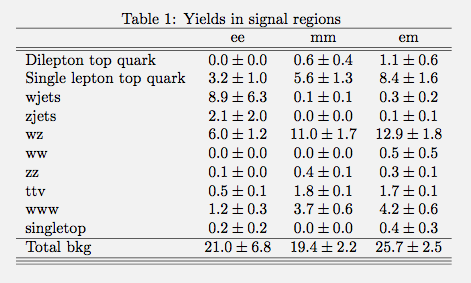

You can use MarkDown Viewer-like programs to see this in pretty format:
https://chrome.google.com/webstore/detail/markdown-viewer/ckkdlimhmcjmikdlpkmbgfkaikojcb

## Syncing up on May 25th

Synced up running few samples separately.
Now trying to sync up en masse.

### Mia's weighted yields



### HJ's weighted yields


### Philip's Weighted yields (entire cutflow with only SSmm channel)

|W%l|ZZ%l|tt1l%l|wwwincl%l|Total Background|WW%f|ttX%f|WZ%f|tX%f|tt2l%f|Z%f|
|---------|---------|---------|---------|---------|---------|---------|---------|---------|---------|---------|
|0.08+- 0.08| 0.40+- 0.07| 5.85+- 1.28| 3.75+- 0.55| 15.06+- 1.79| 0.00+- 0.00| 1.81+- 0.21| 10.91+- 1.59| 1.82+- 0.70| 0.53+- 0.37| 0.00+- 0.00|

### Mia's raw yields


### HJ's raw yields


### Philip's Raw yields (entire cutflow with only SSmm channel)

|W%l|ZZ%l|tt1l%l|wwwincl%l|Total Background|WW%f|WZ%f|Z%f|tt2l%f|ttX%f|tX%f|
|---------|---------|---------|---------|---------|---------|---------|---------|---------|---------|---------|
|1.00+- 1.00| 29.00+- 5.39| 21.00+- 4.58| 64.00+- 8.00| 527.00+- 22.96| 0.00+- 0.00| 47.00+- 6.86| 0.00+- 0.00| 2.00+- 1.41| 299.00+- 17.29| 179.00+- 13.38|


## Philip's section (May 25th)

### Philip's Weighted yields (entire cutflow with only SSmm channel)

|W%l|ZZ%l|tt1l%l|wwwincl%l|Total Background|WW%f|ttX%f|WZ%f|tX%f|tt2l%f|Z%f|
|---------|---------|---------|---------|---------|---------|---------|---------|---------|---------|---------|
|0.00+- 0.00| 0.00+- 0.00| 0.00+- 0.00| 0.00+- 0.00| 0.00+- 0.00| 0.00+- 0.00| 0.00+- 0.00| 0.00+- 0.00| 0.00+- 0.00| 0.00+- 0.00| 0.00+- 0.00|
|245033.40+- 4841.88| 8037.90+- 11.72| 257393.14+- 268.52| 290.74+- 4.80| 558455.81+- 2132.02| 2457.05+- 59.43| 6281.67+- 35.85| 25361.25+- 75.41| 48678.52+- 103.00| 124508.91+- 181.12| 351168.42+- 2119.34|
|1493.49+- 317.68| 2143.92+- 6.04| 1050.25+- 17.15| 123.24+- 3.13| 81882.85+- 585.45| 155.36+- 9.91| 1385.04+- 11.82| 8118.98+- 43.40| 2113.34+- 22.97| 25112.98+- 81.34| 44997.14+- 577.48|
|269.10+- 157.70| 208.60+- 1.71| 237.93+- 8.16| 36.00+- 1.68| 2016.90+- 40.49| 1.84+- 0.92| 240.71+- 3.19| 1414.02+- 18.11| 79.30+- 3.22| 94.85+- 5.00| 186.17+- 35.57|
|269.10+- 157.70| 208.60+- 1.71| 237.93+- 8.16| 36.00+- 1.68| 2016.90+- 40.49| 1.84+- 0.92| 240.71+- 3.19| 1414.02+- 18.11| 79.30+- 3.22| 94.85+- 5.00| 186.17+- 35.57|
|269.10+- 157.70| 208.60+- 1.71| 237.93+- 8.16| 36.00+- 1.68| 2016.90+- 40.49| 1.84+- 0.92| 240.71+- 3.19| 1414.02+- 18.11| 79.30+- 3.22| 94.85+- 5.00| 186.17+- 35.57|
|68.91+- 13.20| 71.67+- 1.01| 226.45+- 7.96| 25.94+- 1.44| 944.35+- 18.51| 0.92+- 0.65| 235.08+- 3.13| 529.09+- 11.07| 59.44+- 2.73| 72.19+- 4.36| 47.63+- 13.54|
|32.20+- 8.02| 26.70+- 0.61| 204.70+- 7.57| 24.97+- 1.41| 594.00+- 13.35| 0.46+- 0.46| 173.73+- 2.29| 310.01+- 8.47| 41.31+- 2.52| 51.90+- 3.70| 16.59+- 9.00|
|17.99+- 5.63| 4.43+- 0.25| 154.87+- 6.59| 21.43+- 1.31| 275.54+- 6.23| 0.00+- 0.00| 119.61+- 1.68| 111.36+- 5.08| 21.19+- 1.89| 20.02+- 2.30| 3.35+- 1.16|
|7.90+- 3.37| 3.93+- 0.24| 144.46+- 6.36| 20.88+- 1.30| 255.68+- 5.96| 0.00+- 0.00| 113.05+- 1.64| 101.03+- 4.84| 19.53+- 1.81| 19.23+- 2.25| 2.83+- 1.07|
|2.30+- 2.23| 2.50+- 0.19| 42.98+- 3.46| 9.92+- 0.92| 95.38+- 4.14| 0.00+- 0.00| 25.18+- 0.74| 49.04+- 3.37| 9.06+- 1.36| 10.80+- 1.69| 1.31+- 0.75|
|0.08+- 0.08| 1.14+- 0.13| 29.02+- 2.85| 7.07+- 0.76| 56.45+- 3.03| 0.00+- 0.00| 20.03+- 0.67| 22.92+- 2.30| 5.34+- 1.04| 6.85+- 1.34| 1.31+- 0.75|
|0.08+- 0.08| 0.68+- 0.10| 26.81+- 2.74| 6.38+- 0.71| 45.44+- 2.60| 0.00+- 0.00| 19.34+- 0.62| 14.68+- 1.84| 4.84+- 1.02| 5.27+- 1.18| 1.31+- 0.75|
|0.08+- 0.08| 0.68+- 0.10| 26.81+- 2.74| 6.38+- 0.71| 45.43+- 2.60| 0.00+- 0.00| 19.34+- 0.62| 14.68+- 1.84| 4.84+- 1.02| 5.27+- 1.18| 1.31+- 0.75|
|0.08+- 0.08| 0.40+- 0.07| 5.85+- 1.28| 3.75+- 0.55| 15.06+- 1.79| 0.00+- 0.00| 1.81+- 0.21| 10.91+- 1.59| 1.82+- 0.70| 0.53+- 0.37| 0.00+- 0.00|
|0.00+- 0.00| 0.00+- 0.00| 0.00+- 0.00| 0.00+- 0.00| 0.00+- 0.00| 0.00+- 0.00| 0.00+- 0.00| 0.00+- 0.00| 0.00+- 0.00| 0.00+- 0.00| 0.00+- 0.00|
|0.00+- 0.00| 0.00+- 0.00| 0.00+- 0.00| 0.00+- 0.00| 0.00+- 0.00| 0.00+- 0.00| 0.00+- 0.00| 0.00+- 0.00| 0.00+- 0.00| 0.00+- 0.00| 0.00+- 0.00|
|0.00+- 0.00| 0.00+- 0.00| 0.00+- 0.00| 0.00+- 0.00| 0.00+- 0.00| 0.00+- 0.00| 0.00+- 0.00| 0.00+- 0.00| 0.00+- 0.00| 0.00+- 0.00| 0.00+- 0.00|
|0.00+- 0.00| 0.00+- 0.00| 0.00+- 0.00| 0.00+- 0.00| 0.00+- 0.00| 0.00+- 0.00| 0.00+- 0.00| 0.00+- 0.00| 0.00+- 0.00| 0.00+- 0.00| 0.00+- 0.00|
|0.00+- 0.00| 0.00+- 0.00| 0.00+- 0.00| 0.00+- 0.00| 0.00+- 0.00| 0.00+- 0.00| 0.00+- 0.00| 0.00+- 0.00| 0.00+- 0.00| 0.00+- 0.00| 0.00+- 0.00|


### Philip's Raw yields (entire cutflow with only SSmm channel)

|W%l|ZZ%l|tt1l%l|wwwincl%l|Total Background|WW%f|WZ%f|Z%f|tt2l%f|ttX%f|tX%f|
|---------|---------|---------|---------|---------|---------|---------|---------|---------|---------|---------|
|0.00+- 0.00| 0.00+- 0.00| 0.00+- 0.00| 0.00+- 0.00| 0.00+- 0.00| 0.00+- 0.00| 0.00+- 0.00| 0.00+- 0.00| 0.00+- 0.00| 0.00+- 0.00| 0.00+- 0.00|
|115372.00+- 339.66| 583330.00+- 763.76| 919331.00+- 958.82| 4798.00+- 69.27| 2911156.00+- 1706.21| 2814.00+- 53.05| 155465.00+- 394.29| 216670.00+- 465.48| 472577.00+- 687.44| 712694.00+- 844.21| 1350936.00+- 1162.30|
|802.00+- 28.32| 155294.00+- 394.07| 3753.00+- 61.26| 2041.00+- 45.18| 855819.00+- 925.10| 309.00+- 17.58| 35254.00+- 187.76| 56884.00+- 238.50| 95317.00+- 308.73| 196556.00+- 443.35| 471499.00+- 686.66|
|123.00+- 11.09| 15105.00+- 122.90| 850.00+- 29.15| 587.00+- 24.23| 104499.00+- 323.26| 4.00+- 2.00| 6136.00+- 78.33| 157.00+- 12.53| 360.00+- 18.97| 36993.00+- 192.34| 60849.00+- 246.68|
|123.00+- 11.09| 15105.00+- 122.90| 850.00+- 29.15| 587.00+- 24.23| 104499.00+- 323.26| 4.00+- 2.00| 6136.00+- 78.33| 157.00+- 12.53| 360.00+- 18.97| 36993.00+- 192.34| 60849.00+- 246.68|
|123.00+- 11.09| 15105.00+- 122.90| 850.00+- 29.15| 587.00+- 24.23| 104499.00+- 323.26| 4.00+- 2.00| 6136.00+- 78.33| 157.00+- 12.53| 360.00+- 18.97| 36993.00+- 192.34| 60849.00+- 246.68|
|105.00+- 10.25| 5197.00+- 72.09| 809.00+- 28.44| 430.00+- 20.74| 89727.00+- 299.54| 2.00+- 1.41| 2313.00+- 48.09| 127.00+- 11.27| 274.00+- 16.55| 36086.00+- 189.96| 50925.00+- 225.67|
|62.00+- 7.87| 1936.00+- 44.00| 731.00+- 27.04| 414.00+- 20.35| 55020.00+- 234.56| 1.00+- 1.00| 1364.00+- 36.93| 42.00+- 6.48| 197.00+- 14.04| 26764.00+- 163.60| 26652.00+- 163.25|
|40.00+- 6.32| 318.00+- 17.83| 553.00+- 23.52| 357.00+- 18.89| 29697.00+- 172.33| 0.00+- 0.00| 494.00+- 22.23| 16.00+- 4.00| 76.00+- 8.72| 18126.00+- 134.63| 10985.00+- 104.81|
|28.00+- 5.29| 282.00+- 16.79| 516.00+- 22.72| 349.00+- 18.68| 28106.00+- 167.65| 0.00+- 0.00| 448.00+- 21.17| 13.00+- 3.61| 73.00+- 8.54| 17099.00+- 130.76| 10473.00+- 102.34|
|2.00+- 1.41| 178.00+- 13.34| 154.00+- 12.41| 175.00+- 13.23| 6925.00+- 83.22| 0.00+- 0.00| 215.00+- 14.66| 3.00+- 1.73| 41.00+- 6.40| 3655.00+- 60.46| 3011.00+- 54.87|
|1.00+- 1.00| 81.00+- 9.00| 104.00+- 10.20| 120.00+- 10.95| 4769.00+- 69.06| 0.00+- 0.00| 101.00+- 10.05| 3.00+- 1.73| 26.00+- 5.10| 2922.00+- 54.06| 1717.00+- 41.44|
|1.00+- 1.00| 48.00+- 6.93| 96.00+- 9.80| 106.00+- 10.30| 4272.00+- 65.36| 0.00+- 0.00| 64.00+- 8.00| 3.00+- 1.73| 20.00+- 4.47| 2817.00+- 53.08| 1368.00+- 36.99|
|1.00+- 1.00| 48.00+- 6.93| 96.00+- 9.80| 106.00+- 10.30| 4270.00+- 65.35| 0.00+- 0.00| 64.00+- 8.00| 3.00+- 1.73| 20.00+- 4.47| 2816.00+- 53.07| 1367.00+- 36.97|
|1.00+- 1.00| 29.00+- 5.39| 21.00+- 4.58| 64.00+- 8.00| 527.00+- 22.96| 0.00+- 0.00| 47.00+- 6.86| 0.00+- 0.00| 2.00+- 1.41| 299.00+- 17.29| 179.00+- 13.38|
|0.00+- 0.00| 0.00+- 0.00| 0.00+- 0.00| 0.00+- 0.00| 0.00+- 0.00| 0.00+- 0.00| 0.00+- 0.00| 0.00+- 0.00| 0.00+- 0.00| 0.00+- 0.00| 0.00+- 0.00|
|0.00+- 0.00| 0.00+- 0.00| 0.00+- 0.00| 0.00+- 0.00| 0.00+- 0.00| 0.00+- 0.00| 0.00+- 0.00| 0.00+- 0.00| 0.00+- 0.00| 0.00+- 0.00| 0.00+- 0.00|
|0.00+- 0.00| 0.00+- 0.00| 0.00+- 0.00| 0.00+- 0.00| 0.00+- 0.00| 0.00+- 0.00| 0.00+- 0.00| 0.00+- 0.00| 0.00+- 0.00| 0.00+- 0.00| 0.00+- 0.00|
|0.00+- 0.00| 0.00+- 0.00| 0.00+- 0.00| 0.00+- 0.00| 0.00+- 0.00| 0.00+- 0.00| 0.00+- 0.00| 0.00+- 0.00| 0.00+- 0.00| 0.00+- 0.00| 0.00+- 0.00|
|0.00+- 0.00| 0.00+- 0.00| 0.00+- 0.00| 0.00+- 0.00| 0.00+- 0.00| 0.00+- 0.00| 0.00+- 0.00| 0.00+- 0.00| 0.00+- 0.00| 0.00+- 0.00| 0.00+- 0.00|


## Yields for SSmm

### 70 fb-1 event counts
 | cuts                                                                                         | wwwincl%l |       |             | wwwmia%l  |       |             | Total Background |       |             | ttX%f     |       |             | VV%f      |       |             | WZ%f      |       |             | tX%f      |       |             | tt%f      |       |             | V%f       |       |             |
 | ----                                                                                         | --------- | ----- | ----------- | --------- | ----- | ----------- | ---------        | ----- | ----------- | --------- | ----- | ----------- | --------- | ----- | ----------- | --------- | ----- | ----------- | --------- | ----- | ----------- | --------- | ----- | ----------- | --------- | ----- | ----------- |
 | ```ana_data.lepcol["goodlep"].size() == 2    (pt > 20 GeV fabs(eta) < 2.4)               ``` | 166.9     | +-    | 3.6         | 2798.5    | +-    | 49.4        | 253023.6         | +-    | 2125.3      | 1786.3    | +-    | 14.7        | 3524.7    | +-    | 18.7        | 9318.9    | +-    | 46.5        | 3363.5    | +-    | 29.3        | 41938.8   | +-    | 105.3       | 193091.5  | +-    | 2121.9      |
 | ```mytree.nisoTrack_mt2() == 0                                                           ``` | 143.1     | +-    | 3.4         | 2378.0    | +-    | 45.5        | 234094.7         | +-    | 2056.3      | 1309.8    | +-    | 13.1        | 2258.4    | +-    | 17.8        | 6584.7    | +-    | 39.1        | 3000.7    | +-    | 28.1        | 38049.0   | +-    | 100.3       | 182892.1  | +-    | 2053.1      |
 | ```ana_data.lepcol["goodlep"][0].pdgId * ana_data.lepcol["goodlep"][1].pdgId == pdgidprod``` | 41.3      | +-    | 1.8         | 675.6     | +-    | 24.3        | 4674.3           | +-    | 454.4       | 223.5     | +-    | 3.1         | 158.1     | +-    | 1.6         | 1300.8    | +-    | 17.4        | 114.8     | +-    | 4.4         | 553.4     | +-    | 12.4        | 2323.5    | +-    | 453.9       |
 | ```ana_data.lepcol["goodlep"][0].p4.Pt() > 30.                                           ``` | 40.1      | +-    | 1.8         | 654.3     | +-    | 24.0        | 3986.4           | +-    | 390.8       | 217.7     | +-    | 3.1         | 135.9     | +-    | 1.5         | 1201.8    | +-    | 16.7        | 103.7     | +-    | 4.2         | 506.4     | +-    | 11.8        | 1820.8    | +-    | 390.2       |
 | ```ana_data.lepcol["goodlep"][1].p4.Pt() > 30.                                           ``` | 30.0      | +-    | 1.5         | 493.6     | +-    | 20.6        | 2480.9           | +-    | 377.8       | 158.4     | +-    | 2.4         | 66.9      | +-    | 1.1         | 765.5     | +-    | 13.3        | 45.6      | +-    | 2.5         | 227.8     | +-    | 7.9         | 1216.7    | +-    | 377.5       |
 | ```ana_data.jetcol["goodjet"].size() >= 2                                                ``` | 21.4      | +-    | 1.3         | 377.0     | +-    | 18.0        | 864.6            | +-    | 49.6        | 154.3     | +-    | 2.3         | 17.5      | +-    | 0.5         | 240.5     | +-    | 7.5         | 30.0      | +-    | 2.0         | 200.7     | +-    | 7.5         | 221.7     | +-    | 48.4        |
 | ```ana_data.jetcol["goodjet"][0].p4.Pt() > 30.                                           ``` | 21.2      | +-    | 1.3         | 367.9     | +-    | 17.8        | 802.2            | +-    | 46.3        | 153.9     | +-    | 2.3         | 14.1      | +-    | 0.5         | 217.2     | +-    | 7.1         | 29.0      | +-    | 2.0         | 198.0     | +-    | 7.4         | 190.0     | +-    | 45.1        |
 | ```ana_data.jetcol["goodjet"][1].p4.Pt() > 20.                                           ``` | 21.2      | +-    | 1.3         | 367.9     | +-    | 17.8        | 802.2            | +-    | 46.3        | 153.9     | +-    | 2.3         | 14.1      | +-    | 0.5         | 217.2     | +-    | 7.1         | 29.0      | +-    | 2.0         | 198.0     | +-    | 7.4         | 190.0     | +-    | 45.1        |
 | ```fabs(ana_data.jetcol["goodjet"][0].p4.Eta()) < 2.5                                    ``` | 21.2      | +-    | 1.3         | 367.9     | +-    | 17.8        | 802.2            | +-    | 46.3        | 153.9     | +-    | 2.3         | 14.1      | +-    | 0.5         | 217.2     | +-    | 7.1         | 29.0      | +-    | 2.0         | 198.0     | +-    | 7.4         | 190.0     | +-    | 45.1        |
 | ```fabs(ana_data.jetcol["goodjet"][1].p4.Eta()) < 2.5                                    ``` | 21.2      | +-    | 1.3         | 367.9     | +-    | 17.8        | 802.2            | +-    | 46.3        | 153.9     | +-    | 2.3         | 14.1      | +-    | 0.5         | 217.2     | +-    | 7.1         | 29.0      | +-    | 2.0         | 198.0     | +-    | 7.4         | 190.0     | +-    | 45.1        |
 | ```ana_data.jetcol["medbjet"].size() == 0                                                ``` | 18.3      | +-    | 1.2         | 316.9     | +-    | 16.6        | 504.6            | +-    | 44.0        | 33.1      | +-    | 1.1         | 13.0      | +-    | 0.4         | 200.0     | +-    | 6.8         | 12.5      | +-    | 1.5         | 74.9      | +-    | 4.6         | 171.0     | +-    | 43.2        |
 | ```VarUtil::DEta(ana_data.jetcol["goodjet"][0], ana_data.jetcol["goodjet"][1]) < 1.5     ``` | 14.6      | +-    | 1.1         | 253.6     | +-    | 14.8        | 356.9            | +-    | 35.7        | 25.2      | +-    | 0.9         | 8.0       | +-    | 0.3         | 129.5     | +-    | 5.5         | 7.5       | +-    | 1.2         | 56.0      | +-    | 3.9         | 130.7     | +-    | 35.0        |
 | ```VarUtil::Mass(ana_data.jetcol["goodjet"][0], ana_data.jetcol["goodjet"][1]) < 105.    ``` | 8.3       | +-    | 0.8         | 151.6     | +-    | 11.5        | 220.0            | +-    | 30.3        | 9.4       | +-    | 0.5         | 6.5       | +-    | 0.3         | 83.5      | +-    | 4.4         | 5.2       | +-    | 1.1         | 28.4      | +-    | 2.8         | 87.0      | +-    | 29.8        |
 | ```VarUtil::Mass(ana_data.jetcol["goodjet"][0], ana_data.jetcol["goodjet"][1]) >  65.    ``` | 6.0       | +-    | 0.7         | 99.0      | +-    | 9.4         | 111.4            | +-    | 22.1        | 6.8       | +-    | 0.4         | 2.5       | +-    | 0.2         | 36.8      | +-    | 2.9         | 3.2       | +-    | 0.8         | 18.2      | +-    | 2.2         | 43.8      | +-    | 21.8        |
 | ```VarUtil::Mass(ana_data.lepcol["goodlep"][0], ana_data.lepcol["goodlep"][1]) >  40.    ``` | 5.8       | +-    | 0.7         | 91.4      | +-    | 9.1         | 90.8             | +-    | 18.3        | 6.3       | +-    | 0.4         | 2.2       | +-    | 0.2         | 32.7      | +-    | 2.8         | 3.1       | +-    | 0.8         | 15.2      | +-    | 2.0         | 31.4      | +-    | 17.9        |

### raw event counts
 | cuts                                                                                         | wwwincl%l | wwwmia%l  | Total Background | WZ%f      | V%f       | VV%f      | ttX%f     | tt%f      | tX%f      |
 | ----                                                                                         | --------- | --------- | ---------        | --------- | --------- | --------- | --------- | --------- | --------- |
 | ```ana_data.lepcol["goodlep"].size() == 2    (pt > 20 GeV fabs(eta) < 2.4)               ``` | 2761.0    | 4198.0    | 1281036.0        | 40943.0   | 106305.0  | 220414.0  | 241710.0  | 158617.0  | 513047.0  |
 | ```mytree.nisoTrack_mt2() == 0                                                           ``` | 2355.0    | 3568.0    | 926759.0         | 29034.0   | 98999.0   | 130511.0  | 170807.0  | 143967.0  | 353441.0  |
 | ```ana_data.lepcol["goodlep"][0].pdgId * ana_data.lepcol["goodlep"][1].pdgId == pdgidprod``` | 675.0     | 1021.0    | 97651.0          | 5717.0    | 454.0     | 11416.0   | 33729.0   | 2000.0    | 44335.0   |
 | ```ana_data.lepcol["goodlep"][0].p4.Pt() > 30.                                           ``` | 652.0     | 989.0     | 93254.0          | 5280.0    | 417.0     | 9809.0    | 32922.0   | 1830.0    | 42996.0   |
 | ```ana_data.lepcol["goodlep"][1].p4.Pt() > 30.                                           ``` | 489.0     | 732.0     | 63292.0          | 3325.0    | 247.0     | 4819.0    | 24011.0   | 824.0     | 30066.0   |
 | ```ana_data.jetcol["goodjet"].size() >= 2                                                ``` | 357.0     | 559.0     | 50388.0          | 1054.0    | 159.0     | 1273.0    | 23316.0   | 724.0     | 23862.0   |
 | ```ana_data.jetcol["goodjet"][0].p4.Pt() > 30.                                           ``` | 352.0     | 545.0     | 49389.0          | 953.0     | 155.0     | 1018.0    | 23260.0   | 714.0     | 23289.0   |
 | ```ana_data.jetcol["goodjet"][1].p4.Pt() > 20.                                           ``` | 352.0     | 545.0     | 49389.0          | 953.0     | 155.0     | 1018.0    | 23260.0   | 714.0     | 23289.0   |
 | ```fabs(ana_data.jetcol["goodjet"][0].p4.Eta()) < 2.5                                    ``` | 352.0     | 545.0     | 49389.0          | 953.0     | 155.0     | 1018.0    | 23260.0   | 714.0     | 23289.0   |
 | ```fabs(ana_data.jetcol["goodjet"][1].p4.Eta()) < 2.5                                    ``` | 352.0     | 545.0     | 49389.0          | 953.0     | 155.0     | 1018.0    | 23260.0   | 714.0     | 23289.0   |
 | ```ana_data.jetcol["medbjet"].size() == 0                                                ``` | 308.0     | 474.0     | 14775.0          | 874.0     | 123.0     | 945.0     | 4905.0    | 270.0     | 7658.0    |
 | ```VarUtil::DEta(ana_data.jetcol["goodjet"][0], ana_data.jetcol["goodjet"][1]) < 1.5     ``` | 246.0     | 375.0     | 9151.0           | 565.0     | 83.0      | 584.0     | 3878.0    | 202.0     | 3839.0    |
 | ```VarUtil::Mass(ana_data.jetcol["goodjet"][0], ana_data.jetcol["goodjet"][1]) < 105.    ``` | 149.0     | 229.0     | 4504.0           | 361.0     | 18.0      | 471.0     | 1395.0    | 103.0     | 2156.0    |
 | ```VarUtil::Mass(ana_data.jetcol["goodjet"][0], ana_data.jetcol["goodjet"][1]) >  65.    ``` | 103.0     | 152.0     | 2572.0           | 160.0     | 9.0       | 185.0     | 1070.0    | 66.0      | 1082.0    |
 | ```VarUtil::Mass(ana_data.lepcol["goodlep"][0], ana_data.lepcol["goodlep"][1]) >  40.    ``` | 100.0     | 142.0     | 2398.0           | 141.0     | 8.0       | 157.0     | 1004.0    | 55.0      | 1033.0    |


## Yields for SSee

### 70 fb-1 event counts

 | cuts                                                                                          | wwwincl%l |       |             | wwwmia%l  |       |             | Total Background |       |             | ttX%f     |       |             | VV%f      |       |             | WZ%f      |       |             | tX%f      |       |             | tt%f      |       |             | V%f       |       |             |
 | ----                                                                                          | --------- | ----- | ----------- | --------- | ----- | ----------- | ---------        | ----- | ----------- | --------- | ----- | ----------- | --------- | ----- | ----------- | --------- | ----- | ----------- | --------- | ----- | ----------- | --------- | ----- | ----------- | --------- | ----- | ----------- |
 | ```ana_data.lepcol["goodlep"].size() == 2    (pt > 20 GeV fabs(eta) < 2.4)               ```  | 166.9     | +-    | 3.6         | 2798.5    | +-    | 49.4        | 253023.6         | +-    | 2125.3      | 1786.3    | +-    | 14.7        | 3524.7    | +-    | 18.7        | 9318.9    | +-    | 46.5        | 3363.5    | +-    | 29.3        | 41938.8   | +-    | 105.3       | 193091.5  | +-    | 2121.9      |
 | ```mytree.nisoTrack_mt2() == 0                                                           ```  | 143.1     | +-    | 3.4         | 2378.0    | +-    | 45.5        | 234094.7         | +-    | 2056.3      | 1309.8    | +-    | 13.1        | 2258.4    | +-    | 17.8        | 6584.7    | +-    | 39.1        | 3000.7    | +-    | 28.1        | 38049.0   | +-    | 100.3       | 182892.1  | +-    | 2053.1      |
 | ```ana_data.lepcol["goodlep"][0].pdgId * ana_data.lepcol["goodlep"][1].pdgId == pdgidprod```  | 24.9      | +-    | 1.4         | 387.7     | +-    | 18.2        | 113755.2         | +-    | 1303.2      | 168.5     | +-    | 4.8         | 284.9     | +-    | 8.6         | 703.0     | +-    | 12.7        | 195.7     | +-    | 6.8         | 1479.8    | +-    | 19.9        | 110923.3  | +-    | 1303.0      |
 | ```ana_data.lepcol["goodlep"][0].p4.Pt() > 30.                                           ```  | 23.9      | +-    | 1.4         | 380.8     | +-    | 18.1        | 107949.9         | +-    | 1248.2      | 166.7     | +-    | 4.7         | 272.3     | +-    | 8.6         | 659.8     | +-    | 12.3        | 186.2     | +-    | 6.6         | 1433.4    | +-    | 19.6        | 105231.5  | +-    | 1247.9      |
 | ```ana_data.lepcol["goodlep"][1].p4.Pt() > 30.                                           ```  | 17.5      | +-    | 1.2         | 289.4     | +-    | 15.8        | 84191.4          | +-    | 1030.0      | 126.4     | +-    | 4.1         | 185.1     | +-    | 7.0         | 434.9     | +-    | 10.0        | 122.6     | +-    | 5.5         | 997.3     | +-    | 16.3        | 82325.0   | +-    | 1029.7      |
 | ```ana_data.jetcol["goodjet"].size() >= 2                                                ```  | 13.7      | +-    | 1.1         | 211.0     | +-    | 13.6        | 10644.3          | +-    | 261.7       | 123.6     | +-    | 4.1         | 63.1      | +-    | 3.4         | 157.4     | +-    | 6.0         | 78.4      | +-    | 4.3         | 860.1     | +-    | 15.2        | 9361.7    | +-    | 261.1       |
 | ```ana_data.jetcol["goodjet"][0].p4.Pt() > 30.                                           ```  | 13.5      | +-    | 1.1         | 206.4     | +-    | 13.5        | 8660.1           | +-    | 227.7       | 123.0     | +-    | 4.1         | 57.8      | +-    | 3.2         | 146.9     | +-    | 5.8         | 76.8      | +-    | 4.3         | 848.2     | +-    | 15.1        | 7407.4    | +-    | 227.1       |
 | ```ana_data.jetcol["goodjet"][1].p4.Pt() > 20.                                           ```  | 13.5      | +-    | 1.1         | 206.4     | +-    | 13.5        | 8660.1           | +-    | 227.7       | 123.0     | +-    | 4.1         | 57.8      | +-    | 3.2         | 146.9     | +-    | 5.8         | 76.8      | +-    | 4.3         | 848.2     | +-    | 15.1        | 7407.4    | +-    | 227.1       |
 | ```fabs(ana_data.jetcol["goodjet"][0].p4.Eta()) < 2.5                                    ```  | 13.5      | +-    | 1.1         | 206.4     | +-    | 13.5        | 8660.1           | +-    | 227.7       | 123.0     | +-    | 4.1         | 57.8      | +-    | 3.2         | 146.9     | +-    | 5.8         | 76.8      | +-    | 4.3         | 848.2     | +-    | 15.1        | 7407.4    | +-    | 227.1       |
 | ```fabs(ana_data.jetcol["goodjet"][1].p4.Eta()) < 2.5                                    ```  | 13.5      | +-    | 1.1         | 206.4     | +-    | 13.5        | 8660.1           | +-    | 227.7       | 123.0     | +-    | 4.1         | 57.8      | +-    | 3.2         | 146.9     | +-    | 5.8         | 76.8      | +-    | 4.3         | 848.2     | +-    | 15.1        | 7407.4    | +-    | 227.1       |
 | ```ana_data.jetcol["medbjet"].size() == 0                                                ```  | 12.5      | +-    | 1.0         | 188.1     | +-    | 12.8        | 7305.3           | +-    | 221.0       | 24.5      | +-    | 1.9         | 49.5      | +-    | 3.0         | 133.5     | +-    | 5.5         | 28.6      | +-    | 2.6         | 213.7     | +-    | 7.6         | 6855.5    | +-    | 220.8       |
 | ```VarUtil::DEta(ana_data.jetcol["goodjet"][0], ana_data.jetcol["goodjet"][1]) < 1.5     ```  | 9.2       | +-    | 0.9         | 142.4     | +-    | 11.2        | 4693.1           | +-    | 178.5       | 19.0      | +-    | 1.7         | 36.1      | +-    | 2.6         | 87.9      | +-    | 4.5         | 18.1      | +-    | 2.1         | 142.6     | +-    | 6.2         | 4389.4    | +-    | 178.3       |
 | ```VarUtil::Mass(ana_data.jetcol["goodjet"][0], ana_data.jetcol["goodjet"][1]) < 105.    ```  | 5.1       | +-    | 0.7         | 87.6      | +-    | 8.8         | 3340.2           | +-    | 164.1       | 8.5       | +-    | 1.0         | 25.0      | +-    | 2.1         | 58.9      | +-    | 3.7         | 11.1      | +-    | 1.7         | 72.2      | +-    | 4.4         | 3164.5    | +-    | 164.0       |
 | ```VarUtil::Mass(ana_data.jetcol["goodjet"][0], ana_data.jetcol["goodjet"][1]) >  65.    ```  | 4.3       | +-    | 0.6         | 60.2      | +-    | 7.4         | 1434.5           | +-    | 90.7        | 6.8       | +-    | 1.0         | 13.8      | +-    | 1.2         | 26.7      | +-    | 2.5         | 5.4       | +-    | 1.1         | 44.6      | +-    | 3.5         | 1337.2    | +-    | 90.6        |
 | ```VarUtil::Mass(ana_data.lepcol["goodlep"][0], ana_data.lepcol["goodlep"][1]) >  40.    ```  | 4.1       | +-    | 0.6         | 57.9      | +-    | 7.2         | 1411.4           | +-    | 88.7        | 6.4       | +-    | 1.0         | 13.4      | +-    | 1.2         | 25.0      | +-    | 2.4         | 4.8       | +-    | 1.1         | 43.0      | +-    | 3.4         | 1318.8    | +-    | 88.6        |
 | ```VarUtil::Mass(ana_data.lepcol["goodlep"][0], ana_data.lepcol["goodlep"][1]) >  40.    ```   | 3.1       | +-    | 0.5         | 39.6      | +-    | 6.0         | 192.3            | +-    | 30.4        | 4.7       | +-    | 0.8         | 3.2       | +-    | 0.8         | 18.0      | +-    | 2.0         | 2.7       | +-    | 0.8         | 27.0      | +-    | 2.7         | 136.7     | +-    | 30.2        |


## Sample grouping on Philip

    hadd Target file: WWW_v0.1.4/haddoutput/hist_bkg_V_1.root
    hadd compression setting for all ouput: 1
    hadd Source file 1: WWW_v0.1.4/output//wjets_ht100_mgmlm_ext1_skim_1_hist.root
    hadd Source file 2: WWW_v0.1.4/output//wjets_ht1200_mgmlm_nonext_skim_1_hist.root
    hadd Source file 3: WWW_v0.1.4/output//wjets_ht200_mgmlm_ext1_skim_1_hist.root
    hadd Source file 4: WWW_v0.1.4/output//wjets_ht2500_mgmlm_ext1_skim_1_hist.root
    hadd Source file 5: WWW_v0.1.4/output//wjets_ht400_mgmlm_ext1_skim_1_hist.root
    hadd Source file 6: WWW_v0.1.4/output//wjets_ht600_mgmlm_ext1_skim_1_hist.root
    hadd Source file 7: WWW_v0.1.4/output//wjets_ht800_mgmlm_ext1_skim_1_hist.root
    hadd Source file 8: WWW_v0.1.4/output//wjets_incl_mgmlm_skim_1_hist.root
    hadd Source file 9: WWW_v0.1.4/output//dy_m1050_mgmlm_skim_1_hist.root
    hadd Source file 10: WWW_v0.1.4/output//dy_m50_mgmlm_ext1_skim_1_hist.root
    hadd Source file 11: WWW_v0.1.4/output//dy_m50_mgmlm_ht100_ext1_skim_1_hist.root
    hadd Source file 12: WWW_v0.1.4/output//dy_m50_mgmlm_ht1200_nonext_skim_1_hist.root
    hadd Source file 13: WWW_v0.1.4/output//dy_m50_mgmlm_ht200_ext1_skim_1_hist.root
    hadd Source file 14: WWW_v0.1.4/output//dy_m50_mgmlm_ht2500_nonext_skim_1_hist.root
    hadd Source file 15: WWW_v0.1.4/output//dy_m50_mgmlm_ht400_ext1_skim_1_hist.root
    hadd Source file 16: WWW_v0.1.4/output//dy_m50_mgmlm_ht600_nonext_skim_1_hist.root
    hadd Source file 17: WWW_v0.1.4/output//dy_m50_mgmlm_ht800_nonext_skim_1_hist.root
    hadd Source file 18: WWW_v0.1.4/output//gjetsht100_dr0p05_mgmlm_nonext_skim_1_hist.root
    hadd Source file 19: WWW_v0.1.4/output//gjetsht200_dr0p05_mgmlm_ext1_skim_1_hist.root
    hadd Source file 20: WWW_v0.1.4/output//gjetsht400_dr0p05_mgmlm_nonext_skim_1_hist.root
    hadd Source file 21: WWW_v0.1.4/output//gjetsht40_dr0p05_mgmlm_ext1_skim_1_hist.root
    hadd Source file 22: WWW_v0.1.4/output//gjetsht600_dr0p05_mgmlm_ext1_skim_1_hist.root
    hadd Source file 23: WWW_v0.1.4/output//wgjets_incl_amcnlo_skim_1_hist.root
    hadd Target path: WWW_v0.1.4/haddoutput/hist_bkg_V_1.root:/
    hadd Target file: WWW_v0.1.4/haddoutput/hist_bkg_VV_5.root
    hadd compression setting for all ouput: 1
    hadd Source file 1: WWW_v0.1.4/output//ww_2l2nu_powheg_skim_1_hist.root
    hadd Source file 2: WWW_v0.1.4/output//ww_lnuqq_powheg_skim_1_hist.root
    hadd Source file 3: WWW_v0.1.4/output//zz_2l2n_powheg_skim_1_hist.root
    hadd Source file 4: WWW_v0.1.4/output//zz_2l2q_powheg_skim_1_hist.root
    hadd Source file 5: WWW_v0.1.4/output//zz_2q2n_amcnlo_skim_1_hist.root
    hadd Source file 6: WWW_v0.1.4/output//zz_4l_powheg_skim_1_hist.root
    hadd Target path: WWW_v0.1.4/haddoutput/hist_bkg_VV_5.root:/
    hadd Target file: WWW_v0.1.4/haddoutput/hist_bkg_WW_5.root
    hadd compression setting for all ouput: 1
    hadd Source file 1: WWW_v0.1.4/output//ww_2l2nu_powheg_skim_1_hist.root
    hadd Source file 2: WWW_v0.1.4/output//ww_lnuqq_powheg_skim_1_hist.root
    hadd Target path: WWW_v0.1.4/haddoutput/hist_bkg_WW_5.root:/
    hadd Target file: WWW_v0.1.4/haddoutput/hist_bkg_WZ_6.root
    hadd compression setting for all ouput: 1
    hadd Source file 1: WWW_v0.1.4/output//wz_1l3n_amcnlo_skim_1_hist.root
    hadd Source file 2: WWW_v0.1.4/output//wz_3lnu_powheg_skim_1_hist.root
    hadd Source file 3: WWW_v0.1.4/output//wz_lnqq_amcnlo_skim_1_hist.root
    hadd Target path: WWW_v0.1.4/haddoutput/hist_bkg_WZ_6.root:/
    hadd Target file: WWW_v0.1.4/haddoutput/hist_bkg_Z_1.root
    hadd compression setting for all ouput: 1
    hadd Source file 1: WWW_v0.1.4/output//dy_m1050_mgmlm_skim_1_hist.root
    hadd Source file 2: WWW_v0.1.4/output//dy_m50_mgmlm_ext1_skim_1_hist.root
    hadd Source file 3: WWW_v0.1.4/output//dy_m50_mgmlm_ht100_ext1_skim_1_hist.root
    hadd Source file 4: WWW_v0.1.4/output//dy_m50_mgmlm_ht1200_nonext_skim_1_hist.root
    hadd Source file 5: WWW_v0.1.4/output//dy_m50_mgmlm_ht200_ext1_skim_1_hist.root
    hadd Source file 6: WWW_v0.1.4/output//dy_m50_mgmlm_ht2500_nonext_skim_1_hist.root
    hadd Source file 7: WWW_v0.1.4/output//dy_m50_mgmlm_ht400_ext1_skim_1_hist.root
    hadd Source file 8: WWW_v0.1.4/output//dy_m50_mgmlm_ht600_nonext_skim_1_hist.root
    hadd Source file 9: WWW_v0.1.4/output//dy_m50_mgmlm_ht800_nonext_skim_1_hist.root
    hadd Target path: WWW_v0.1.4/haddoutput/hist_bkg_Z_1.root:/
    hadd Target file: WWW_v0.1.4/haddoutput/hist_bkg_tX_2.root
    hadd compression setting for all ouput: 1
    hadd Source file 1: WWW_v0.1.4/output//tzq_ll_amcnlo_skim_1_hist.root
    hadd Source file 2: WWW_v0.1.4/output//tzq_ll_amcnlo_skim_2_hist.root
    hadd Source file 3: WWW_v0.1.4/output//tzq_ll_amcnlo_skim_3_hist.root
    hadd Source file 4: WWW_v0.1.4/output//stt_antitop_incdec_powheg_skim_1_hist.root
    hadd Source file 5: WWW_v0.1.4/output//stt_top_incdec_powheg_skim_1_hist.root
    hadd Source file 6: WWW_v0.1.4/output//sttw_antitop_nofullhaddecay_powheg_skim_1_hist.root
    hadd Source file 7: WWW_v0.1.4/output//sttw_top_nofullhaddecay_powheg_skim_1_hist.root
    hadd Source file 8: WWW_v0.1.4/output//sttwll_madgraph_skim_1_hist.root
    hadd Target path: WWW_v0.1.4/haddoutput/hist_bkg_tX_2.root:/
    hadd Target file: WWW_v0.1.4/haddoutput/hist_bkg_tt_4.root
    hadd compression setting for all ouput: 1
    hadd Source file 1: WWW_v0.1.4/output//ttbar_1ltbr_mgmlm_ext1_skim_1_hist.root
    hadd Source file 2: WWW_v0.1.4/output//ttbar_1ltbr_mgmlm_ext1_skim_2_hist.root
    hadd Source file 3: WWW_v0.1.4/output//ttbar_1ltop_mgmlm_ext1_skim_1_hist.root
    hadd Source file 4: WWW_v0.1.4/output//ttbar_1ltop_mgmlm_ext1_skim_2_hist.root
    hadd Source file 5: WWW_v0.1.4/output//ttbar_dilep_mgmlm_ext1_skim_1_hist.root
    hadd Source file 6: WWW_v0.1.4/output//ttbar_dilep_mgmlm_ext1_skim_2_hist.root
    hadd Target path: WWW_v0.1.4/haddoutput/hist_bkg_tt_4.root:/
    hadd Target file: WWW_v0.1.4/haddoutput/hist_bkg_tt2l_4.root
    hadd compression setting for all ouput: 1
    hadd Source file 1: WWW_v0.1.4/output//ttbar_dilep_mgmlm_ext1_skim_1_hist.root
    hadd Source file 2: WWW_v0.1.4/output//ttbar_dilep_mgmlm_ext1_skim_2_hist.root
    hadd Target path: WWW_v0.1.4/haddoutput/hist_bkg_tt2l_4.root:/
    hadd Target file: WWW_v0.1.4/haddoutput/hist_bkg_ttX,_3.root
    hadd compression setting for all ouput: 1
    hadd Source file 1: WWW_v0.1.4/output//ttg_incl_amcnlo_skim_1_hist.root
    hadd Source file 2: WWW_v0.1.4/output//tth_bb_powheg_skim_1_hist.root
    hadd Source file 3: WWW_v0.1.4/output//tth_nonbb_powheg_skim_1_hist.root
    hadd Source file 4: WWW_v0.1.4/output//ttw_incl_mgmlm_skim_1_hist.root
    hadd Source file 5: WWW_v0.1.4/output//ttz_incl_mgmlm_skim_1_hist.root
    hadd Target path: WWW_v0.1.4/haddoutput/hist_bkg_ttX,_3.root:/
    hadd Target file: WWW_v0.1.4/haddoutput/hist_bkg_ttX_3.root
    hadd compression setting for all ouput: 1
    hadd Source file 1: WWW_v0.1.4/output//ttg_incl_amcnlo_skim_1_hist.root
    hadd Source file 2: WWW_v0.1.4/output//tth_bb_powheg_skim_1_hist.root
    hadd Source file 3: WWW_v0.1.4/output//tth_nonbb_powheg_skim_1_hist.root
    hadd Source file 4: WWW_v0.1.4/output//ttw_incl_mgmlm_skim_1_hist.root
    hadd Source file 5: WWW_v0.1.4/output//ttz_incl_mgmlm_skim_1_hist.root
    hadd Target path: WWW_v0.1.4/haddoutput/hist_bkg_ttX_3.root:/
    hadd Target file: WWW_v0.1.4/haddoutput/hist_sig_W_3.root
    hadd compression setting for all ouput: 1
    hadd Source file 1: WWW_v0.1.4/output//wjets_ht100_mgmlm_ext1_skim_1_hist.root
    hadd Source file 2: WWW_v0.1.4/output//wjets_ht1200_mgmlm_nonext_skim_1_hist.root
    hadd Source file 3: WWW_v0.1.4/output//wjets_ht200_mgmlm_ext1_skim_1_hist.root
    hadd Source file 4: WWW_v0.1.4/output//wjets_ht2500_mgmlm_ext1_skim_1_hist.root
    hadd Source file 5: WWW_v0.1.4/output//wjets_ht400_mgmlm_ext1_skim_1_hist.root
    hadd Source file 6: WWW_v0.1.4/output//wjets_ht600_mgmlm_ext1_skim_1_hist.root
    hadd Source file 7: WWW_v0.1.4/output//wjets_ht800_mgmlm_ext1_skim_1_hist.root
    hadd Source file 8: WWW_v0.1.4/output//wjets_incl_mgmlm_skim_1_hist.root
    hadd Target path: WWW_v0.1.4/haddoutput/hist_sig_W_3.root:/
    hadd Target file: WWW_v0.1.4/haddoutput/hist_sig_ZZ_4.root
    hadd compression setting for all ouput: 1
    hadd Source file 1: WWW_v0.1.4/output//zz_2l2n_powheg_skim_1_hist.root
    hadd Source file 2: WWW_v0.1.4/output//zz_2l2q_powheg_skim_1_hist.root
    hadd Source file 3: WWW_v0.1.4/output//zz_2q2n_amcnlo_skim_1_hist.root
    hadd Source file 4: WWW_v0.1.4/output//zz_4l_powheg_skim_1_hist.root
    hadd Target path: WWW_v0.1.4/haddoutput/hist_sig_ZZ_4.root:/
    hadd Target file: WWW_v0.1.4/haddoutput/hist_sig_sig1_1.root
    hadd compression setting for all ouput: 1
    hadd Source file 1: WWW_v0.1.4/output//www_2l_mia_skim_1_hist.root
    hadd Source file 2: WWW_v0.1.4/output//www_incl_amcnlo_skim_1_hist.root
    hadd Target path: WWW_v0.1.4/haddoutput/hist_sig_sig1_1.root:/
    hadd Target file: WWW_v0.1.4/haddoutput/hist_sig_tt1l_2.root
    hadd compression setting for all ouput: 1
    hadd Source file 1: WWW_v0.1.4/output//ttbar_1ltbr_mgmlm_ext1_skim_1_hist.root
    hadd Source file 2: WWW_v0.1.4/output//ttbar_1ltbr_mgmlm_ext1_skim_2_hist.root
    hadd Source file 3: WWW_v0.1.4/output//ttbar_1ltop_mgmlm_ext1_skim_1_hist.root
    hadd Source file 4: WWW_v0.1.4/output//ttbar_1ltop_mgmlm_ext1_skim_2_hist.root
    hadd Target path: WWW_v0.1.4/haddoutput/hist_sig_tt1l_2.root:/
    hadd Target file: WWW_v0.1.4/haddoutput/hist_sig_www_incl_2.root
    hadd compression setting for all ouput: 1
    hadd Target file: WWW_v0.1.4/haddoutput/hist_sig_www_mia_1.root
    hadd compression setting for all ouput: 1
    hadd Source file 1: WWW_v0.1.4/output//www_2l_mia_skim_1_hist.root
    hadd Target path: WWW_v0.1.4/haddoutput/hist_sig_www_mia_1.root:/
    hadd Target file: WWW_v0.1.4/haddoutput/hist_sig_wwwincl_1.root
    hadd compression setting for all ouput: 1
    hadd Source file 1: WWW_v0.1.4/output//www_incl_amcnlo_skim_1_hist.root
    hadd Target path: WWW_v0.1.4/haddoutput/hist_sig_wwwincl_1.root:/
    hadd Target file: WWW_v0.1.4/haddoutput/hist_sig_wwwmia_1.root
    hadd compression setting for all ouput: 1
    hadd Source file 1: WWW_v0.1.4/output//www_2l_mia_skim_1_hist.root
    hadd Target path: WWW_v0.1.4/haddoutput/hist_sig_wwwmia_1.root:/


## Samples used from Bobak's v0.1.4

### Backgrounds

    /nfs-7/userdata/bhashemi/WWW_babies/WWW_v0.1.4/skim//dy_m1050_mgmlm_skim_1.root
    /nfs-7/userdata/bhashemi/WWW_babies/WWW_v0.1.4/skim//dy_m50_mgmlm_ext1_skim_1.root
    /nfs-7/userdata/bhashemi/WWW_babies/WWW_v0.1.4/skim//dy_m50_mgmlm_ht100_ext1_skim_1.root
    /nfs-7/userdata/bhashemi/WWW_babies/WWW_v0.1.4/skim//dy_m50_mgmlm_ht200_ext1_skim_1.root
    /nfs-7/userdata/bhashemi/WWW_babies/WWW_v0.1.4/skim//dy_m50_mgmlm_ht400_ext1_skim_1.root
    /nfs-7/userdata/bhashemi/WWW_babies/WWW_v0.1.4/skim//dy_m50_mgmlm_ht600_nonext_skim_1.root
    /nfs-7/userdata/bhashemi/WWW_babies/WWW_v0.1.4/skim//dy_m50_mgmlm_ht800_nonext_skim_1.root
    /nfs-7/userdata/bhashemi/WWW_babies/WWW_v0.1.4/skim//dy_m50_mgmlm_ht1200_nonext_skim_1.root
    /nfs-7/userdata/bhashemi/WWW_babies/WWW_v0.1.4/skim//dy_m50_mgmlm_ht2500_nonext_skim_1.root
    /nfs-7/userdata/bhashemi/WWW_babies/WWW_v0.1.4/skim//gjetsht40_dr0p05_mgmlm_ext1_skim_1.root
    /nfs-7/userdata/bhashemi/WWW_babies/WWW_v0.1.4/skim//gjetsht100_dr0p05_mgmlm_nonext_skim_1.root
    /nfs-7/userdata/bhashemi/WWW_babies/WWW_v0.1.4/skim//gjetsht200_dr0p05_mgmlm_ext1_skim_1.root
    /nfs-7/userdata/bhashemi/WWW_babies/WWW_v0.1.4/skim//gjetsht400_dr0p05_mgmlm_nonext_skim_1.root
    /nfs-7/userdata/bhashemi/WWW_babies/WWW_v0.1.4/skim//gjetsht600_dr0p05_mgmlm_ext1_skim_1.root
    /nfs-7/userdata/bhashemi/WWW_babies/WWW_v0.1.4/skim//stt_antitop_incdec_powheg_skim_1.root
    /nfs-7/userdata/bhashemi/WWW_babies/WWW_v0.1.4/skim//stt_top_incdec_powheg_skim_1.root
    /nfs-7/userdata/bhashemi/WWW_babies/WWW_v0.1.4/skim//sttw_antitop_nofullhaddecay_powheg_skim_1.root
    /nfs-7/userdata/bhashemi/WWW_babies/WWW_v0.1.4/skim//sttw_top_nofullhaddecay_powheg_skim_1.root
    /nfs-7/userdata/bhashemi/WWW_babies/WWW_v0.1.4/skim//sttwll_madgraph_skim_1.root
    /nfs-7/userdata/bhashemi/WWW_babies/WWW_v0.1.4/skim//ttbar_1ltbr_mgmlm_ext1_skim_1.root
    /nfs-7/userdata/bhashemi/WWW_babies/WWW_v0.1.4/skim//ttbar_1ltbr_mgmlm_ext1_skim_2.root
    /nfs-7/userdata/bhashemi/WWW_babies/WWW_v0.1.4/skim//ttbar_1ltop_mgmlm_ext1_skim_1.root
    /nfs-7/userdata/bhashemi/WWW_babies/WWW_v0.1.4/skim//ttbar_1ltop_mgmlm_ext1_skim_2.root
    /nfs-7/userdata/bhashemi/WWW_babies/WWW_v0.1.4/skim//ttbar_dilep_mgmlm_ext1_skim_1.root
    /nfs-7/userdata/bhashemi/WWW_babies/WWW_v0.1.4/skim//ttbar_dilep_mgmlm_ext1_skim_2.root
    /nfs-7/userdata/bhashemi/WWW_babies/WWW_v0.1.4/skim//ttg_incl_amcnlo_skim_1.root
    /nfs-7/userdata/bhashemi/WWW_babies/WWW_v0.1.4/skim//tth_bb_powheg_skim_1.root
    /nfs-7/userdata/bhashemi/WWW_babies/WWW_v0.1.4/skim//tth_nonbb_powheg_skim_1.root
    /nfs-7/userdata/bhashemi/WWW_babies/WWW_v0.1.4/skim//ttw_incl_mgmlm_skim_1.root
    /nfs-7/userdata/bhashemi/WWW_babies/WWW_v0.1.4/skim//ttz_incl_mgmlm_skim_1.root
    /nfs-7/userdata/bhashemi/WWW_babies/WWW_v0.1.4/skim//tzq_ll_amcnlo_skim_1.root
    /nfs-7/userdata/bhashemi/WWW_babies/WWW_v0.1.4/skim//tzq_ll_amcnlo_skim_2.root
    /nfs-7/userdata/bhashemi/WWW_babies/WWW_v0.1.4/skim//tzq_ll_amcnlo_skim_3.root
    /nfs-7/userdata/bhashemi/WWW_babies/WWW_v0.1.4/skim//wgjets_incl_amcnlo_skim_1.root
    /nfs-7/userdata/bhashemi/WWW_babies/WWW_v0.1.4/skim//wjets_ht100_mgmlm_ext1_skim_1.root
    /nfs-7/userdata/bhashemi/WWW_babies/WWW_v0.1.4/skim//wjets_ht200_mgmlm_ext1_skim_1.root
    /nfs-7/userdata/bhashemi/WWW_babies/WWW_v0.1.4/skim//wjets_ht400_mgmlm_ext1_skim_1.root
    /nfs-7/userdata/bhashemi/WWW_babies/WWW_v0.1.4/skim//wjets_ht600_mgmlm_ext1_skim_1.root
    /nfs-7/userdata/bhashemi/WWW_babies/WWW_v0.1.4/skim//wjets_ht800_mgmlm_ext1_skim_1.root
    /nfs-7/userdata/bhashemi/WWW_babies/WWW_v0.1.4/skim//wjets_ht1200_mgmlm_nonext_skim_1.root
    /nfs-7/userdata/bhashemi/WWW_babies/WWW_v0.1.4/skim//wjets_ht2500_mgmlm_ext1_skim_1.root
    /nfs-7/userdata/bhashemi/WWW_babies/WWW_v0.1.4/skim//wjets_incl_mgmlm_skim_1.root
    /nfs-7/userdata/bhashemi/WWW_babies/WWW_v0.1.4/skim//ww_2l2nu_powheg_skim_1.root
    /nfs-7/userdata/bhashemi/WWW_babies/WWW_v0.1.4/skim//ww_lnuqq_powheg_skim_1.root
    /nfs-7/userdata/bhashemi/WWW_babies/WWW_v0.1.4/skim//wwz_incl_amcnlo_skim_1.root
    /nfs-7/userdata/bhashemi/WWW_babies/WWW_v0.1.4/skim//wz_1l3n_amcnlo_skim_1.root
    /nfs-7/userdata/bhashemi/WWW_babies/WWW_v0.1.4/skim//wz_3lnu_powheg_skim_1.root
    /nfs-7/userdata/bhashemi/WWW_babies/WWW_v0.1.4/skim//wz_lnqq_amcnlo_skim_1.root
    /nfs-7/userdata/bhashemi/WWW_babies/WWW_v0.1.4/skim//wzz_incl_amcnlo_skim_1.root
    /nfs-7/userdata/bhashemi/WWW_babies/WWW_v0.1.4/skim//znunugamma_ptg40_mgmlm_skim_1.root
    /nfs-7/userdata/bhashemi/WWW_babies/WWW_v0.1.4/skim//znunugamma_ptg130_mgmlm_skim_1.root
    /nfs-7/userdata/bhashemi/WWW_babies/WWW_v0.1.4/skim//zz_2l2n_powheg_skim_1.root
    /nfs-7/userdata/bhashemi/WWW_babies/WWW_v0.1.4/skim//zz_2l2q_powheg_skim_1.root
    /nfs-7/userdata/bhashemi/WWW_babies/WWW_v0.1.4/skim//zz_2q2n_amcnlo_skim_1.root
    /nfs-7/userdata/bhashemi/WWW_babies/WWW_v0.1.4/skim//zz_4l_powheg_skim_1.root
    /nfs-7/userdata/bhashemi/WWW_babies/WWW_v0.1.4/skim//zzz_incl_amcnlo_skim_1.root

### To stitch W+jets and DY HT samples with inclusive, I do the following

    // HT filter stitching for DY
    if (LoopUtil::output_name.Contains("dy_m50") && !LoopUtil::output_name.Contains("_ht"))
      if (mytree.gen_ht() > 100.)
        return;

    // HT filter stitching for wjets
    if (LoopUtil::output_name.Contains("wjets_incl"))
      if (mytree.gen_ht() > 100.)
        return;


### Signal

    /nfs-7/userdata/bhashemi/WWW_babies/WWW_v0.1.4/skim//www_2l_mia_skim_1.root
    /nfs-7/userdata/bhashemi/WWW_babies/WWW_v0.1.4/skim//www_incl_amcnlo_skim_1.root


### Then I hadd the samples

    hadd Target file: WWW_v0.1.4/haddoutput/hist_bkg_V_1.root
    hadd compression setting for all ouput: 1
    hadd Source file 1: WWW_v0.1.4/output//wjets_ht100_mgmlm_ext1_skim_1_hist.root
    hadd Source file 2: WWW_v0.1.4/output//wjets_ht1200_mgmlm_nonext_skim_1_hist.root
    hadd Source file 3: WWW_v0.1.4/output//wjets_ht200_mgmlm_ext1_skim_1_hist.root
    hadd Source file 4: WWW_v0.1.4/output//wjets_ht2500_mgmlm_ext1_skim_1_hist.root
    hadd Source file 5: WWW_v0.1.4/output//wjets_ht400_mgmlm_ext1_skim_1_hist.root
    hadd Source file 6: WWW_v0.1.4/output//wjets_ht600_mgmlm_ext1_skim_1_hist.root
    hadd Source file 7: WWW_v0.1.4/output//wjets_ht800_mgmlm_ext1_skim_1_hist.root
    hadd Source file 8: WWW_v0.1.4/output//wjets_incl_mgmlm_skim_1_hist.root
    hadd Source file 9: WWW_v0.1.4/output//dy_m1050_mgmlm_skim_1_hist.root
    hadd Source file 10: WWW_v0.1.4/output//dy_m50_mgmlm_ext1_skim_1_hist.root
    hadd Source file 11: WWW_v0.1.4/output//dy_m50_mgmlm_ht100_ext1_skim_1_hist.root
    hadd Source file 12: WWW_v0.1.4/output//dy_m50_mgmlm_ht1200_nonext_skim_1_hist.root
    hadd Source file 13: WWW_v0.1.4/output//dy_m50_mgmlm_ht200_ext1_skim_1_hist.root
    hadd Source file 14: WWW_v0.1.4/output//dy_m50_mgmlm_ht2500_nonext_skim_1_hist.root
    hadd Source file 15: WWW_v0.1.4/output//dy_m50_mgmlm_ht400_ext1_skim_1_hist.root
    hadd Source file 16: WWW_v0.1.4/output//dy_m50_mgmlm_ht600_nonext_skim_1_hist.root
    hadd Source file 17: WWW_v0.1.4/output//dy_m50_mgmlm_ht800_nonext_skim_1_hist.root
    hadd Source file 18: WWW_v0.1.4/output//gjetsht100_dr0p05_mgmlm_nonext_skim_1_hist.root
    hadd Source file 19: WWW_v0.1.4/output//gjetsht200_dr0p05_mgmlm_ext1_skim_1_hist.root
    hadd Source file 20: WWW_v0.1.4/output//gjetsht400_dr0p05_mgmlm_nonext_skim_1_hist.root
    hadd Source file 21: WWW_v0.1.4/output//gjetsht40_dr0p05_mgmlm_ext1_skim_1_hist.root
    hadd Source file 22: WWW_v0.1.4/output//gjetsht600_dr0p05_mgmlm_ext1_skim_1_hist.root
    hadd Source file 23: WWW_v0.1.4/output//wgjets_incl_amcnlo_skim_1_hist.root
    hadd Target path: WWW_v0.1.4/haddoutput/hist_bkg_V_1.root:/

    hadd Target file: WWW_v0.1.4/haddoutput/hist_bkg_VV_5.root
    hadd compression setting for all ouput: 1
    hadd Source file 1: WWW_v0.1.4/output//ww_2l2nu_powheg_skim_1_hist.root
    hadd Source file 2: WWW_v0.1.4/output//ww_lnuqq_powheg_skim_1_hist.root
    hadd Source file 3: WWW_v0.1.4/output//zz_2l2n_powheg_skim_1_hist.root
    hadd Source file 4: WWW_v0.1.4/output//zz_2l2q_powheg_skim_1_hist.root
    hadd Source file 5: WWW_v0.1.4/output//zz_2q2n_amcnlo_skim_1_hist.root
    hadd Source file 6: WWW_v0.1.4/output//zz_4l_powheg_skim_1_hist.root
    hadd Target path: WWW_v0.1.4/haddoutput/hist_bkg_VV_5.root:/

    hadd Target file: WWW_v0.1.4/haddoutput/hist_bkg_WZ_6.root
    hadd compression setting for all ouput: 1
    hadd Source file 1: WWW_v0.1.4/output//wz_1l3n_amcnlo_skim_1_hist.root
    hadd Source file 2: WWW_v0.1.4/output//wz_3lnu_powheg_skim_1_hist.root
    hadd Source file 3: WWW_v0.1.4/output//wz_lnqq_amcnlo_skim_1_hist.root
    hadd Target path: WWW_v0.1.4/haddoutput/hist_bkg_WZ_6.root:/

    hadd Target file: WWW_v0.1.4/haddoutput/hist_bkg_tX_2.root
    hadd compression setting for all ouput: 1
    hadd Source file 1: WWW_v0.1.4/output//tzq_ll_amcnlo_skim_1_hist.root
    hadd Source file 2: WWW_v0.1.4/output//tzq_ll_amcnlo_skim_2_hist.root
    hadd Source file 3: WWW_v0.1.4/output//tzq_ll_amcnlo_skim_3_hist.root
    hadd Source file 4: WWW_v0.1.4/output//stt_antitop_incdec_powheg_skim_1_hist.root
    hadd Source file 5: WWW_v0.1.4/output//stt_top_incdec_powheg_skim_1_hist.root
    hadd Source file 6: WWW_v0.1.4/output//sttw_antitop_nofullhaddecay_powheg_skim_1_hist.root
    hadd Source file 7: WWW_v0.1.4/output//sttw_top_nofullhaddecay_powheg_skim_1_hist.root
    hadd Source file 8: WWW_v0.1.4/output//sttwll_madgraph_skim_1_hist.root
    hadd Target path: WWW_v0.1.4/haddoutput/hist_bkg_tX_2.root:/

    hadd Target file: WWW_v0.1.4/haddoutput/hist_bkg_tt_4.root
    hadd compression setting for all ouput: 1
    hadd Source file 1: WWW_v0.1.4/output//ttbar_1ltbr_mgmlm_ext1_skim_1_hist.root
    hadd Source file 2: WWW_v0.1.4/output//ttbar_1ltbr_mgmlm_ext1_skim_2_hist.root
    hadd Source file 3: WWW_v0.1.4/output//ttbar_1ltop_mgmlm_ext1_skim_1_hist.root
    hadd Source file 4: WWW_v0.1.4/output//ttbar_1ltop_mgmlm_ext1_skim_2_hist.root
    hadd Source file 5: WWW_v0.1.4/output//ttbar_dilep_mgmlm_ext1_skim_1_hist.root
    hadd Source file 6: WWW_v0.1.4/output//ttbar_dilep_mgmlm_ext1_skim_2_hist.root
    hadd Target path: WWW_v0.1.4/haddoutput/hist_bkg_tt_4.root:/

    hadd Target file: WWW_v0.1.4/haddoutput/hist_bkg_ttX,_3.root
    hadd compression setting for all ouput: 1
    hadd Source file 1: WWW_v0.1.4/output//ttg_incl_amcnlo_skim_1_hist.root
    hadd Source file 2: WWW_v0.1.4/output//tth_bb_powheg_skim_1_hist.root
    hadd Source file 3: WWW_v0.1.4/output//tth_nonbb_powheg_skim_1_hist.root
    hadd Source file 4: WWW_v0.1.4/output//ttw_incl_mgmlm_skim_1_hist.root
    hadd Source file 5: WWW_v0.1.4/output//ttz_incl_mgmlm_skim_1_hist.root
    hadd Target path: WWW_v0.1.4/haddoutput/hist_bkg_ttX,_3.root:/

    hadd Target file: WWW_v0.1.4/haddoutput/hist_bkg_ttX_3.root
    hadd compression setting for all ouput: 1
    hadd Source file 1: WWW_v0.1.4/output//ttg_incl_amcnlo_skim_1_hist.root
    hadd Source file 2: WWW_v0.1.4/output//tth_bb_powheg_skim_1_hist.root
    hadd Source file 3: WWW_v0.1.4/output//tth_nonbb_powheg_skim_1_hist.root
    hadd Source file 4: WWW_v0.1.4/output//ttw_incl_mgmlm_skim_1_hist.root
    hadd Source file 5: WWW_v0.1.4/output//ttz_incl_mgmlm_skim_1_hist.root
    hadd Target path: WWW_v0.1.4/haddoutput/hist_bkg_ttX_3.root:/

    hadd Target file: WWW_v0.1.4/haddoutput/hist_sig_sig1_1.root
    hadd compression setting for all ouput: 1
    hadd Source file 1: WWW_v0.1.4/output//www_2l_mia_skim_1_hist.root
    hadd Source file 2: WWW_v0.1.4/output//www_incl_amcnlo_skim_1_hist.root
    hadd Target path: WWW_v0.1.4/haddoutput/hist_sig_sig1_1.root:/

    hadd Target file: WWW_v0.1.4/haddoutput/hist_sig_www_incl_2.root
    hadd compression setting for all ouput: 1
    hadd Target file: WWW_v0.1.4/haddoutput/hist_sig_www_mia_1.root
    hadd compression setting for all ouput: 1
    hadd Source file 1: WWW_v0.1.4/output//www_2l_mia_skim_1_hist.root
    hadd Target path: WWW_v0.1.4/haddoutput/hist_sig_www_mia_1.root:/

    hadd Target file: WWW_v0.1.4/haddoutput/hist_sig_wwwincl_2.root
    hadd compression setting for all ouput: 1
    hadd Source file 1: WWW_v0.1.4/output//www_incl_amcnlo_skim_1_hist.root
    hadd Target path: WWW_v0.1.4/haddoutput/hist_sig_wwwincl_2.root:/

    hadd Target file: WWW_v0.1.4/haddoutput/hist_sig_wwwmia_1.root
    hadd compression setting for all ouput: 1
    hadd Source file 1: WWW_v0.1.4/output//www_2l_mia_skim_1_hist.root
    hadd Target path: WWW_v0.1.4/haddoutput/hist_sig_wwwmia_1.root:/

